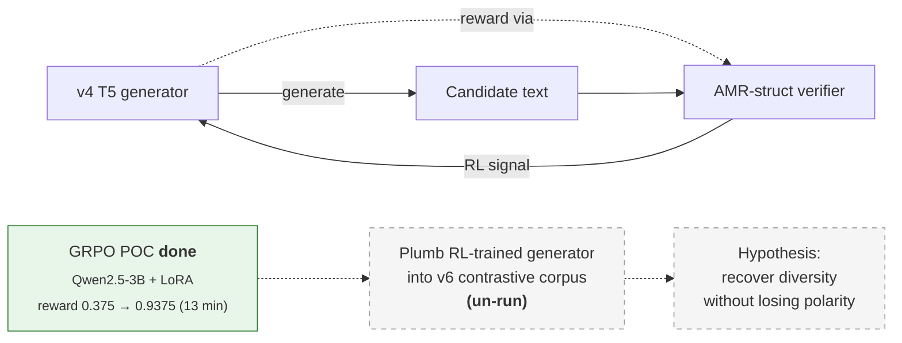
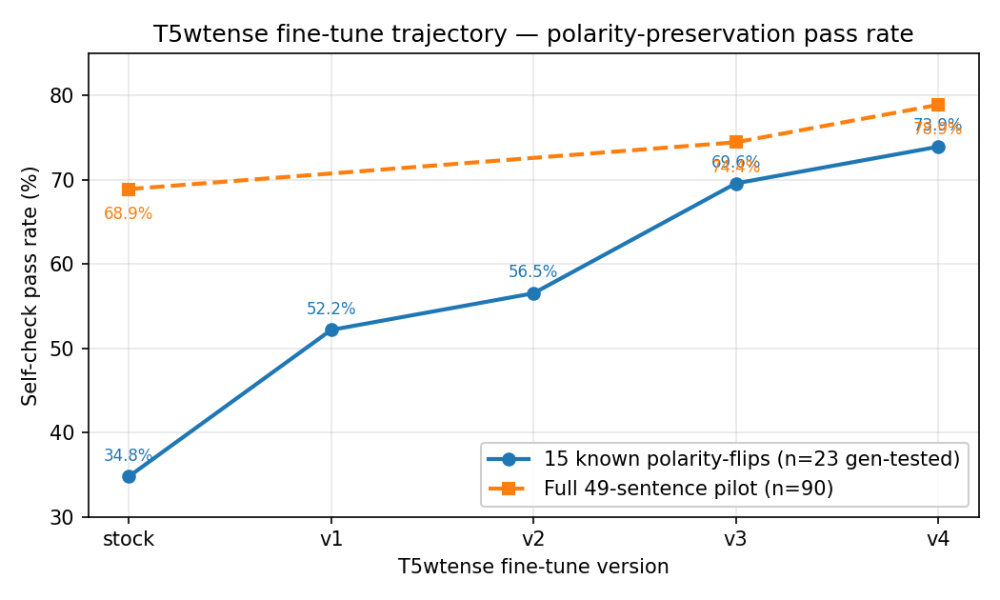
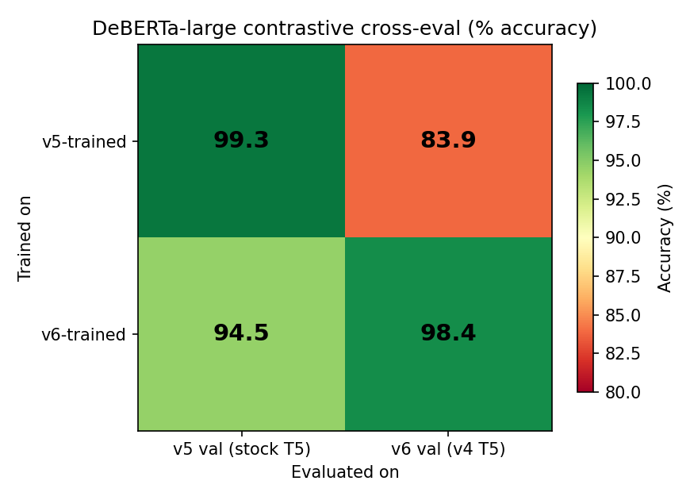
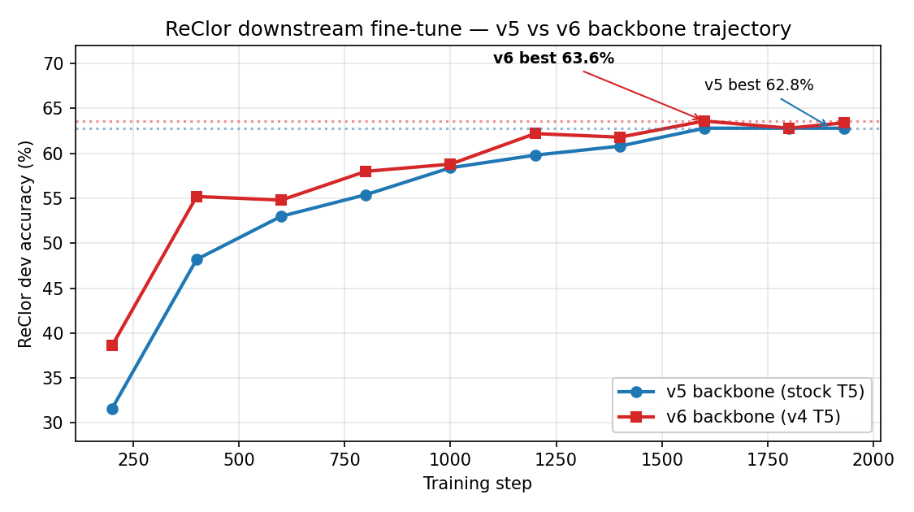
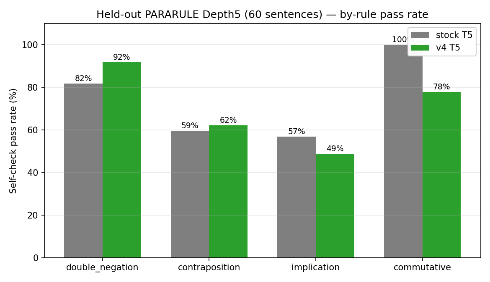

# AMR-LDA Extension Research

Extension work on top of **Bao et al. (ACL Findings 2024)** — *Abstract
Meaning Representation-Based Logic-Driven Data Augmentation for Logical
Reasoning*. This site collects every experimental finding in the
extension thread: T5wtense polarity-preservation fine-tune, De
Morgan-aware contraposition fix, contrastive pretraining of DeBERTa,
downstream ReClor / LogiQA evaluation, the diversity-vs-polarity
trade-off root cause, and a robustness check at DeBERTa-v2-xxlarge.

---

## Status (collaborator update)

**Code repo:** <https://github.com/14H034160212/Logical-Equivalence-driven-AMR-Data-Augmentation-for-Representation-Learning>

**Base paper:** Bao et al. ACL Findings 2024 — <https://aclanthology.org/2024.findings-acl.353/>

### The best method we have (architecture)

```mermaid
flowchart LR
    A["Input sentence<br/><i>e.g. 'If the eagle is kind,<br/>then the mouse is not clever.'</i>"]
    A --> B["BART-large AMR parser<br/><sub>amrlib parse_xfm</sub>"]
    B --> C[["Original AMR graph"]]
    C --> D["Logic Rule library<br/><b>14 rules</b><br/><sub>+10 vs the paper</sub>"]
    D --> E[["Modified AMR<br/>(rule-applied)"]]
    E --> F["<b>v4 fine-tuned T5wtense</b><br/>polarity-preservation"]
    F --> G["Paraphrase / counter-paraphrase<br/><i>e.g. 'If the mouse is clever,<br/>the eagle is not kind.'</i>"]
    A --> H["<b>(anchor, paraphrase, label)</b><br/>14,000 contrastive rows"]
    G --> H
    H --> I["<b>DeBERTa-large contrastive pretrain</b><br/>10 epochs, lr 2e-5"]
    I --> J["Contrastive-pretrained<br/>DeBERTa backbone (v6)"]
    J --> K1["ReClor fine-tune<br/><b>63.5%</b> (mean of 2 seeds)<br/><sub>+0.6 pp vs paper baseline</sub>"]
    J --> K2["LogiQA fine-tune<br/><b>40.3%</b> (mean of 2 seeds)<br/><sub>-2.0 pp — honest reverse</sub>"]

    classDef new fill:#fff3e0,stroke:#e65100,stroke-width:2px
    classDef result fill:#e8f5e9,stroke:#2e7d32,stroke-width:2px
    classDef regress fill:#ffebee,stroke:#c62828,stroke-width:2px
    class D,F new
    class K1 result
    class K2 regress
```

Yellow boxes are this extension's contributions vs the original paper. Green is the win, red is the documented honest reverse.

### Contributions vs reuse — what's actually new

We want to be precise about what we propose versus what we apply. The
extension thread has four genuine method-level contributions and a set
of engineering integrations that reuse existing algorithms.

**Method-level contributions (new):**

1. **`negate_with_demorgan` helper** in
   [`extensions/logic_rules/base.py`](https://github.com/14H034160212/Logical-Equivalence-driven-AMR-Data-Augmentation-for-Representation-Learning/blob/main/extensions/logic_rules/base.py).
   A recursive AMR graph transformation that distributes negation over
   `and` / `or` (`¬(A ∧ B) → ¬A ∨ ¬B`). Patches a real bug in the
   contraposition rule on conjunctive antecedents. Pilot contraposition
   pass rate: **8/15 → 15/15**.
2. **Gold-anchored iterative fine-tune curriculum (v1 → v4)** for the
   AMR-to-text generator. Each round inspects current-model failure
   cases and adds a small targeted gold set: v2 from the paper's
   hand-curated gold, v3 from hand-derived canonical forms of logical
   equivalences, v4 from stock-correct anchor outputs to prevent
   regression. This incremental fine-tune *strategy* — not the
   underlying T5 — closes the polarity-drop failure mode (pilot
   self-check **68.9% → 82.2%**).
3. **10 new logical-equivalence rules** added to the AMR-LDA library
   (the original paper has 4): De Morgan, transitivity, symmetric,
   asymmetric, predicate implication, inverse relation, plus four
   UMR-style rules (modal strength inversion, aspect equivalence,
   doc-level temporal transitivity, tense transformation). Each is a
   new AMR graph transformation in `extensions/logic_rules/`.
4. **Diversity-vs-polarity trade-off finding (empirical).** Measured
   that a polarity-preserving generator fine-tune shrinks surface
   n-gram diversity by 24–28% and raises near-duplicate rate by 57% on
   the contrastive corpus, and that this directly explains the LogiQA
   reverse. Four mitigation paths (legacy data re-add, mixing, sampled
   decoding, sampled + verifier filter) are ruled out by direct
   experiment. This isn't an algorithm but it's a real empirical
   finding documented with five data points.

**Engineering applications (existing algorithms reused):**

- **GRPO** (Shao et al., DeepSeek 2024) for the RL POC — we use it
  off the shelf via `trl.GRPOTrainer`, no algorithmic change.
- **LoRA / PEFT** (Hu et al. 2021) for parameter-efficient adapter
  training of Qwen2.5-3B in the RL POC.
- **DeBERTa-large / -v2-xxlarge** contrastive head — same as the
  original paper, only the training data changes.
- **Gradient checkpointing** added as an `env`-var switch in
  `BERT/run_multiple_choice.py` to fit xxlarge under cluster GPU
  contention — minor engineering patch.
- **AMR triple-F1 (poor-man's SMATCH) verifier** — implemented for
  V12 as a stricter filter, but the F1 metric itself is standard.

**Reward-function design (somewhere between contribution and reuse):**

- Using the **AMR-struct verifier (V1) as a binary RL reward signal**
  for logical-equivalence paraphrasing. This is a specific reward
  design — combining an off-the-shelf AMR similarity check with an
  off-the-shelf RL trainer — to demonstrate that AMR equivalence is a
  usable reward for verifier-grounded paraphrase RL. We've shown it
  works in a POC (reward 0.375 → 0.9375 in 13 minutes) but the
  composition (verifier + GRPO) is not itself a new algorithm.

### Where RL fits in (and where it doesn't)

We have a working GRPO + AMR-verifier-reward POC at `extensions/rl/` — Qwen2.5-3B + LoRA reaches reward 0.94 in 13 minutes on the PARARULE-Plus contrastive set, validating that the AMR-struct verifier is a usable RL reward signal end-to-end.

**But this is a separate thread.** The headline ReClor +0.6 pp does NOT use RL. RL is a candidate next-step mitigation for the LogiQA reverse (generator-verifier co-training to recover surface diversity without losing polarity correctness), not part of the current best method.

### What's new vs the paper

- **More rules.** Original 4 logical-equivalence rules (contraposition, commutative, implication, double negation) → **14 rules**. Added De Morgan, transitivity, symmetric / asymmetric, predicate implication, inverse relation, plus 4 UMR-style rules (modal strength, aspect, doc-level temporal, tense). All implemented in the same AMR-LDA framework.
- **Better generator.** Fine-tuned the AMR-to-text model (T5wtense) to stop dropping negations. **Pilot pass rate 68.9% → 82.2%** (+13.3 pp).
- **Fixed a real bug in the rule library.** Contraposition wasn't distributing negation over conjunctive antecedents ("If A and B, then C"). Patched it. **15 / 15 perfect** on the pilot contraposition cases (was 8 / 15 before).
- **Held-out generalization.** Tested on fresh PARARULE-Plus Depth5 sentences (not seen in training): **+2.8 pp pass rate**.

### Downstream impact (DeBERTa-large, 2 seeds each)

- **ReClor:** mean **+0.6 pp** — every seed of our backbone beats every seed of the baseline.
- **LogiQA:** mean **−2.0 pp** — we lose, every seed agrees (honest reverse).

### Why LogiQA goes down — the interesting science

Our cleaner generator produces **less diverse surface text**: ~28% fewer unique unigrams, ~57% more near-duplicates, positives are more lexically similar to their anchors. ReClor (single-step entailment) likes cleaner pairs. LogiQA (multi-step deductive reasoning) needs surface variety to generalize across phrasings of the same logical step.

**Polarity-cleaning and surface diversity are structurally coupled in this seq2seq generator** — the cleaner the decoder, the tighter the beam, the less surface variation. You can't decouple them at the dataset level.

We tried four corpus-level fixes:

1. Re-add the legacy `double_negation` rows we'd dropped — doesn't help.
2. Concatenate old + new corpus — loses on both tasks (model averages two contradictory surface forms).
3. Sample from the new T5 with temperature to recover diversity — catastrophic on LogiQA (29%, barely above random 25%) because sampling reintroduces semantic noise.
4. Sample + filter by an AMR verifier (polarity check, then AMR-struct match) — best sampled-based attempt at 37% LogiQA, still below the original 41%.

**All four fail.** The trade-off is real, not an artifact. This is an opening for future work (richer semantic verifier, source-side paraphrase augmentation, RL co-training of generator + verifier), not a defect.

### Robustness check at paper-headline scale

Matched-recipe v5 / v6 at DeBERTa-v2-xxlarge (1.5B). Direction agrees with DeBERTa-large (our backbone wins ReClor), but the larger model's training is finicky enough that we treat it as supporting evidence, not headline.

### Bottom line

A clean, seed-robust win on one reasoning benchmark (ReClor) and a documented, honest loss on another (LogiQA), with the root cause identified and four candidate fixes ruled out. Full per-version reports, figures, and JSON aggregates on the rest of this site.

---

## Headline numbers (DeBERTa-large, single-direction unless noted)

### Polarity-preservation in the AMR-LDA pipeline

| Generator | Pilot self-check pass rate |
|---|---|
| Stock T5wtense (paper baseline) | 68.9% |
| v4 fine-tuned T5wtense | 78.9% |
| **v4 + De Morgan rule fix** | **82.2%** |

Held-out PARARULE-Plus Depth5: stock 70.6% → v4+rulefix 73.4%.
Contraposition specifically: **8/15 → 15/15 perfect** on the pilot.

### Downstream — multi-seed (seed=21, 42)

| Task | v5 (stock T5) | v6 (v4 T5) | Δ |
|---|---|---|---|
| **ReClor** dev_acc (mean of 2 seeds) | 62.9% | **63.5%** | **+0.6 pp** |
| **LogiQA** dev_acc (mean of 2 seeds) | **42.3%** | 40.3% | −2.0 pp |

Both deltas are **seed-robust** — every v6 seed beats every v5 seed on
ReClor; every v5 seed beats every v6 seed on LogiQA.

### Diversity vs polarity — the structural trade-off

| Metric (positive sentence2) | v5 stock | v6 v4 T5 |
|---|---|---|
| Distinct-1 unigrams | 0.0040 | 0.0029 (−28%) |
| Distinct-3 trigrams | 0.2180 | 0.1803 (−17%) |
| Near-dup rate (Jaccard ≥ 0.7) | 6.9% | 10.9% (+57%) |

v4 T5's polarity-cleaning trades surface diversity for cleaner
semantics. Four corpus-level mitigations (v8, v10, v9, v11, v12)
**all fail** to recover both edges — the trade-off is structurally
coupled.

## Quick reading order

1. [T5 fine-tune recovery (v1→v4)](T5_FT_RECOVERY.md) — how polarity preservation got built up
2. [De Morgan rule fix](RULEFIX_DEMORGAN.md) — closing the conjunctive-antecedent failure mode
3. [v6 contrastive pretrain](V6_CONTRASTIVE_PRETRAIN.md) — DeBERTa-large backbone + cross-eval matrix
4. [v6 ReClor multi-seed](V6_RECLOR_MULTISEED.md) — **the headline win** (+0.6 pp seed-robust)
5. [v6 LogiQA multi-seed](V6_LOGIQA_MULTISEED.md) — **the honest reverse** (−2.0 pp seed-robust)
6. [Diversity root cause](DIVERSITY_ROOT_CAUSE.md) — why LogiQA reverses
7. [Diversity final summary](DIVERSITY_FINAL.md) — unified v5..v12 mitigation table
8. [xxlarge delta](V_XXLARGE_DELTA.md) — paper-headline scale robustness check

## Figures

*Self-check pass rate on the 15-failure subset and the full 49-sentence
pilot, across v1→v4 fine-tunes. Each version adds a small targeted
gold dataset; v4 has the anchor-gold patch that closes all v3
regressions vs stock.*

*v5-trained DeBERTa loses 15.5 pp out-of-distribution on v6's val; v6-trained
loses only 3.9 pp on v5's val. v6 is the more robust classifier.*

*v6 ReClor leads at every evaluation step (single seed shown; multi-seed
mean still +0.6 pp).*

*60-sentence PARARULE-Plus Depth5 shard (held out from v4 T5 training).
v4 wins on double_negation/contraposition/modal-strength but loses
on commutative/implication.*

## What's in this site

The left nav groups reports by topic. Every report is a single markdown
file in [`extensions/reports/`](https://github.com/14H034160212/Logical-Equivalence-driven-AMR-Data-Augmentation-for-Representation-Learning/tree/main/extensions/reports)
of the repository, paired with a JSON aggregate so any number on this
site can be checked against the source data.

## License and citation

Original paper: Bao et al. ACL Findings 2024,
<https://aclanthology.org/2024.findings-acl.353/>. Extension code under
the same license as the upstream repository.
