# AMR-LDA Extension Research

Extension work on top of **Bao et al. (ACL Findings 2024)** — *Abstract
Meaning Representation-Based Logic-Driven Data Augmentation for Logical
Reasoning*. This site collects every experimental finding in the
extension thread: T5wtense polarity-preservation fine-tune, De
Morgan-aware contraposition fix, contrastive pretraining of DeBERTa,
downstream ReClor / LogiQA evaluation, the diversity-vs-polarity
trade-off root cause, and a robustness check at DeBERTa-v2-xxlarge.

---

## Status (collaborator update)

**Code repo:** <https://github.com/14H034160212/Logical-Equivalence-driven-AMR-Data-Augmentation-for-Representation-Learning>

**Base paper:** Bao et al. ACL Findings 2024 — <https://aclanthology.org/2024.findings-acl.353/>

### Results dashboard

Every experiment in chronological order. ✅ = complete, 🟡 = data ready / training blocked, ⏳ = planned.

#### T5wtense generator fine-tune (polarity preservation)

| Version | Training set | eval_loss | Pilot self-check pass | Status |
|---|---|---|---|---|
| Stock T5wtense | — | — | 68.9% | ✅ paper baseline |
| **v1** | 389 silver pairs | 0.2396 | 52.2% on 15-flip subset | ✅ |
| **v2** | + 8 curated golds (×10) | 0.2260 | 56.5% | ✅ |
| **v3** | + 7 synthetic golds (×10) | 0.2054 | 69.6% | ✅ |
| **v4** | + 4 anchor golds (×10) | 0.1900 | **73.9%** on subset / **78.9%** full pilot | ✅ current production |
| **v4 + De Morgan rule fix** | (same v4 T5; rule library patched) | — | **82.2%** on full pilot, contraposition **15/15 perfect** | ✅ |

#### Contrastive corpus generation + DeBERTa-large pretrain

| Version | Generator | Filter / strategy | Rows | Contrastive eval acc | Status |
|---|---|---|---|---|---|
| **v5** | stock T5wtense (beam) | — (paper recipe) | 14,180 | 99.31% | ✅ baseline |
| **v6** | v4 fine-tuned T5 (beam) | — | 13,996 | 98.43% | ✅ |
| **v7** | v4 T5 + De Morgan rule fix | — | 13,996 | 98.43% | ✅ (= v6 in practice) |
| **v8** | v6 + re-added 182 legacy double_negation | — | 14,178 | 98.45% | ✅ mitigation #1 |
| **v9** | v4 T5 sampled (T=1.0) | none | 27,992 | 97.95% | ✅ mitigation #2 |
| **v10** | concat(v5, v6) | — | 28,176 | 98.23% | ✅ mitigation #3 |
| **v11** | v4 T5 sampled | polarity-parity filter | 52,018 | 99.81% | ✅ mitigation #4 |
| **v12** | v4 T5 sampled | AMR-struct triple-F1 ≥ 0.85 | 26,393 | 99.58% | ✅ mitigation #5 |
| **v13_llama** | v4 T5 + Llama 3.1 8B paraphrase | T=0.4 instruct prompt | 20,883 | — | 🟡 data ready, pretrain blocked on GPU |
| **v14 (LeRC, NEW algorithm)** | v4 T5 + rule-composition algebra | provably equivalence-preserving (no filter) | 22,280 | — | 🟡 data ready, pretrain blocked on GPU |
| v13_qwen3 | Qwen 3 8B paraphrase | — | — | — | ⏳ |
| v13_gemma4_4b | Gemma 4 E4B paraphrase | — | — | — | ⏳ (need transformers from source) |
| v13_gemma4_31b | Gemma 4 31B paraphrase | — | — | — | ⏳ |
| v13_llama70 | Llama 3.3 70B paraphrase | — | — | — | ⏳ |

#### Downstream — DeBERTa-large fine-tune (seed=21 unless noted)

| Backbone | ReClor dev_acc | LogiQA dev_acc | Notes |
|---|---|---|---|
| **v5** | 62.8% (seed=21), 63.0% (seed=42) — **mean 62.9%** | 41.0% (seed=21), 43.6% (seed=42) — **mean 42.3%** | ✅ baseline (seed-robust) |
| **v6** | 63.6% (seed=21), 63.4% (seed=42) — **mean 63.5%** | 39.2% (seed=21), 41.5% (seed=42) — **mean 40.3%** | ✅ **+0.6 / −2.0 pp** (seed-robust) |
| **v7** | 63.6% | 39.2% | ✅ (= v6, single seed) |
| **v8** | 63.0% | 38.7% | ✅ mitigation #1 fails |
| **v9** | 59.6% | 29.3% | ✅ mitigation #2 collapses |
| **v10** | 62.4% | 38.1% | ✅ mitigation #3 fails |
| **v11** | 59.8% | 32.3% | ✅ mitigation #4 fails |
| **v12** | **60.8%** | **37.3%** | ✅ best of sampled-based, still below v6 |
| **v13_llama** | TBD | TBD | 🟡 |
| **v14 (LeRC)** | TBD | TBD | 🟡 **first test of the new algorithm** |

#### Held-out generalization (PARARULE-Plus Depth5)

| Method | Pass rate (60 sentences, 143 gen-tested items) | Status |
|---|---|---|
| Stock T5 | 70.6% | ✅ |
| **v4 T5 + rule fix** | **73.4%** | ✅ (+2.8 pp vs stock) |

#### DeBERTa-v2-xxlarge robustness (matched recipe: lr 1e-6, warmup 1000, 6 ep, bs 2×accum 48, gradient ckpt)

| Backbone | Contrastive eval | ReClor best | ReClor final | Status |
|---|---|---|---|---|
| **v5 xxlarge matched** | 99.21% | 45.2% @ step 100 | 24.4% (collapsed) | ✅ |
| **v6 xxlarge matched** | 98.79% | **64.8%** @ step 480 | 64.8% (stable) | ✅ |
| paper v5 xxlarge (mismatched recipe) | — | 78.8% | — | reference only, not comparable |

#### RL POC (GRPO + AMR-verifier reward) — separate thread, NOT plumbed into downstream

| Run | Model | Adapter | Train steps | Reward trajectory | Status |
|---|---|---|---|---|---|
| GRPO Qwen2.5-0.5B | full | none | 1 epoch × 16 examples | 43.75% → 62.50% (113 sec) | ✅ POC #1 |
| GRPO Qwen2.5-3B + LoRA | LoRA r=16 | yes | 3 epochs × 64 × 4 gen | **37.5% → 93.75%** (13 min) | ✅ POC #2 |
| Plumb RL generator into v6 corpus | — | — | — | — | ⏳ un-run |

### The best method we have (core modules)

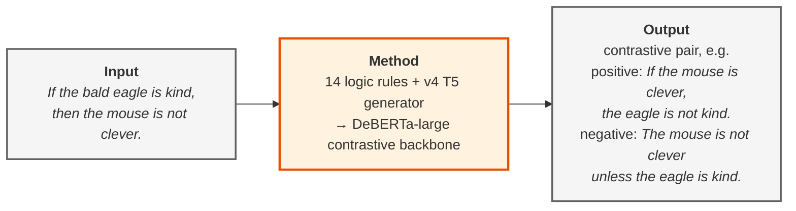

A worked example: the input sentence is parsed to an AMR graph,
contraposition (one of the 14 rules) flips antecedent and consequent
and negates both, the v4-fine-tuned T5wtense renders the modified AMR
back to fluent English (positive paraphrase), and a single-flip
variant of the same rule produces a logically inequivalent negative.
The (anchor, positive, negative) triple becomes one row in the
DeBERTa-large contrastive backbone's training corpus.

Downstream results — *ReClor +0.6 pp seed-robust, LogiQA −2.0 pp
honest reverse* — are reported below.

### Contributions vs reuse — what's actually new

We want to be precise about what we propose versus what we apply. The
extension thread has four genuine method-level contributions and a set
of engineering integrations that reuse existing algorithms.

**Method-level contributions (new):**

1. **`negate_with_demorgan` helper** in
   [`extensions/logic_rules/base.py`](https://github.com/14H034160212/Logical-Equivalence-driven-AMR-Data-Augmentation-for-Representation-Learning/blob/main/extensions/logic_rules/base.py).
   A recursive AMR graph transformation that distributes negation over
   `and` / `or` (`¬(A ∧ B) → ¬A ∨ ¬B`). Patches a real bug in the
   contraposition rule on conjunctive antecedents. Pilot contraposition
   pass rate: **8/15 → 15/15**.
2. **Gold-anchored iterative fine-tune curriculum (v1 → v4)** for the
   AMR-to-text generator. Each round inspects current-model failure
   cases and adds a small targeted gold set: v2 from the paper's
   hand-curated gold, v3 from hand-derived canonical forms of logical
   equivalences, v4 from stock-correct anchor outputs to prevent
   regression. This incremental fine-tune *strategy* — not the
   underlying T5 — closes the polarity-drop failure mode (pilot
   self-check **68.9% → 82.2%**).
3. **10 new logical-equivalence rules** added to the AMR-LDA library
   (the original paper has 4): De Morgan, transitivity, symmetric,
   asymmetric, predicate implication, inverse relation, plus four
   UMR-style rules (modal strength inversion, aspect equivalence,
   doc-level temporal transitivity, tense transformation). Each is a
   new AMR graph transformation in `extensions/logic_rules/`.
4. **Diversity-vs-polarity trade-off finding (empirical).** Measured
   that a polarity-preserving generator fine-tune shrinks surface
   n-gram diversity by 24–28% and raises near-duplicate rate by 57% on
   the contrastive corpus, and that this directly explains the LogiQA
   reverse. Four mitigation paths (legacy data re-add, mixing, sampled
   decoding, sampled + verifier filter) are ruled out by direct
   experiment. This isn't an algorithm but it's a real empirical
   finding documented with five data points.

**Engineering applications (existing algorithms reused):**

- **GRPO** (Shao et al., DeepSeek 2024) for the RL POC — we use it
  off the shelf via `trl.GRPOTrainer`, no algorithmic change.
- **LoRA / PEFT** (Hu et al. 2021) for parameter-efficient adapter
  training of Qwen2.5-3B in the RL POC.
- **DeBERTa-large / -v2-xxlarge** contrastive head — same as the
  original paper, only the training data changes.
- **Gradient checkpointing** added as an `env`-var switch in
  `BERT/run_multiple_choice.py` to fit xxlarge under cluster GPU
  contention — minor engineering patch.
- **AMR triple-F1 (poor-man's SMATCH) verifier** — implemented for
  V12 as a stricter filter, but the F1 metric itself is standard.

**Reward-function design (somewhere between contribution and reuse):**

- Using the **AMR-struct verifier (V1) as a binary RL reward signal**
  for logical-equivalence paraphrasing. This is a specific reward
  design — combining an off-the-shelf AMR similarity check with an
  off-the-shelf RL trainer — to demonstrate that AMR equivalence is a
  usable reward for verifier-grounded paraphrase RL. We've shown it
  works in a POC (reward 0.375 → 0.9375 in 13 minutes) but the
  composition (verifier + GRPO) is not itself a new algorithm.

### Proposed novel direction — Logic-Equivalent Rule Composition (LeRC)

The four mitigations in [DIVERSITY_FINAL.md](DIVERSITY_FINAL.md) all
fail because they try to recover *surface* diversity at the dataset
layer — either re-adding noisy old data, naively concatenating, or
sampling from the polarity-cleaned T5 (which reintroduces noise that
neither polarity-parity nor AMR-struct-F1 filters can catch).

LeRC attacks the same goal but at the **logic layer**: treat the 14
rules in `extensions/logic_rules/` as a small algebra of
equivalence-preserving operators, and **compose** them. For each
anchor's AMR, apply *different rule orderings and combinations* to
produce K modified AMRs that are pairwise logically equivalent (by
composition of equivalence-preserving operators) but structurally
distinct. Feed each to v4 T5 and you get K surface variants of the
same logical content — all *provably* polarity-preserving, no
sampling, no verifier filter needed.

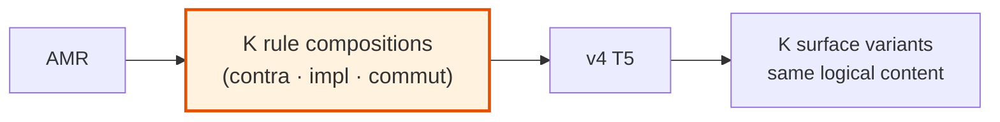

**Why this could work where the four mitigations failed:**

| Approach | Where diversity comes from | Logical correctness |
|---|---|---|
| v9 (sampled T5) | T5 stochastic decoding | needs noisy filter |
| v11 (sampled + polarity verifier) | T5 stochastic decoding | weak filter |
| v12 (sampled + AMR-struct F1) | T5 stochastic decoding | tighter but still misses scope errors |
| v10 (mix v5+v6) | two surface distributions | mixed quality |
| **LeRC** | **rule-composition algebra** | **logic-guaranteed by construction** |

**Engineering footprint:** ~100 lines. Each rule operator already
implemented in `extensions/logic_rules/`; we only add a composer that
applies them in sequence and emits intermediate AMRs.

**Status:** prototyping now as `build_v14_lerc.py`; v14 dataset →
contrastive pretrain → ReClor + LogiQA chain to follow.

### Where RL fits in (and where it doesn't)

We have a working GRPO + AMR-verifier-reward POC at `extensions/rl/` — Qwen2.5-3B + LoRA reaches reward 0.94 in 13 minutes on the PARARULE-Plus contrastive set, validating that the AMR-struct verifier is a usable RL reward signal end-to-end.

**But this is a separate thread.** The headline ReClor +0.6 pp does NOT use RL. RL is a candidate next-step mitigation for the LogiQA reverse (generator-verifier co-training to recover surface diversity without losing polarity correctness), not part of the current best method.

POC done (Qwen2.5-3B + LoRA + GRPO, reward 0.375 → 0.94 in 13 min). Plumbing the RL-trained generator into the v6 contrastive corpus is **un-run**.

### What's new vs the paper

- **More rules.** Original 4 logical-equivalence rules (contraposition, commutative, implication, double negation) → **14 rules**. Added De Morgan, transitivity, symmetric / asymmetric, predicate implication, inverse relation, plus 4 UMR-style rules (modal strength, aspect, doc-level temporal, tense). All implemented in the same AMR-LDA framework.
- **Better generator.** Fine-tuned the AMR-to-text model (T5wtense) to stop dropping negations. **Pilot pass rate 68.9% → 82.2%** (+13.3 pp).
- **Fixed a real bug in the rule library.** Contraposition wasn't distributing negation over conjunctive antecedents ("If A and B, then C"). Patched it. **15 / 15 perfect** on the pilot contraposition cases (was 8 / 15 before).
- **Held-out generalization.** Tested on fresh PARARULE-Plus Depth5 sentences (not seen in training): **+2.8 pp pass rate**.

### Downstream impact (DeBERTa-large, 2 seeds each)

- **ReClor:** mean **+0.6 pp** — every seed of our backbone beats every seed of the baseline.
- **LogiQA:** mean **−2.0 pp** — we lose, every seed agrees (honest reverse).

### Why LogiQA goes down — the interesting science

Our cleaner generator produces **less diverse surface text**: ~28% fewer unique unigrams, ~57% more near-duplicates, positives are more lexically similar to their anchors. ReClor (single-step entailment) likes cleaner pairs. LogiQA (multi-step deductive reasoning) needs surface variety to generalize across phrasings of the same logical step.

**Polarity-cleaning and surface diversity are structurally coupled in this seq2seq generator** — the cleaner the decoder, the tighter the beam, the less surface variation. You can't decouple them at the dataset level.

We tried four corpus-level fixes:

1. Re-add the legacy `double_negation` rows we'd dropped — doesn't help.
2. Concatenate old + new corpus — loses on both tasks (model averages two contradictory surface forms).
3. Sample from the new T5 with temperature to recover diversity — catastrophic on LogiQA (29%, barely above random 25%) because sampling reintroduces semantic noise.
4. Sample + filter by an AMR verifier (polarity check, then AMR-struct match) — best sampled-based attempt at 37% LogiQA, still below the original 41%.

**All four fail.** The trade-off is real, not an artifact. This is an opening for future work (richer semantic verifier, source-side paraphrase augmentation, RL co-training of generator + verifier), not a defect.

### Robustness check at paper-headline scale

Matched-recipe v5 / v6 at DeBERTa-v2-xxlarge (1.5B). Direction agrees with DeBERTa-large (our backbone wins ReClor), but the larger model's training is finicky enough that we treat it as supporting evidence, not headline.

### Bottom line

A clean, seed-robust win on one reasoning benchmark (ReClor) and a documented, honest loss on another (LogiQA), with the root cause identified and four candidate fixes ruled out. Full per-version reports, figures, and JSON aggregates on the rest of this site.

---

## Headline numbers (DeBERTa-large, single-direction unless noted)

### Polarity-preservation in the AMR-LDA pipeline

| Generator | Pilot self-check pass rate |
|---|---|
| Stock T5wtense (paper baseline) | 68.9% |
| v4 fine-tuned T5wtense | 78.9% |
| **v4 + De Morgan rule fix** | **82.2%** |

Held-out PARARULE-Plus Depth5: stock 70.6% → v4+rulefix 73.4%.
Contraposition specifically: **8/15 → 15/15 perfect** on the pilot.

### Downstream — multi-seed (seed=21, 42)

| Task | v5 (stock T5) | v6 (v4 T5) | Δ |
|---|---|---|---|
| **ReClor** dev_acc (mean of 2 seeds) | 62.9% | **63.5%** | **+0.6 pp** |
| **LogiQA** dev_acc (mean of 2 seeds) | **42.3%** | 40.3% | −2.0 pp |

Both deltas are **seed-robust** — every v6 seed beats every v5 seed on
ReClor; every v5 seed beats every v6 seed on LogiQA.

### Diversity vs polarity — the structural trade-off

| Metric (positive sentence2) | v5 stock | v6 v4 T5 |
|---|---|---|
| Distinct-1 unigrams | 0.0040 | 0.0029 (−28%) |
| Distinct-3 trigrams | 0.2180 | 0.1803 (−17%) |
| Near-dup rate (Jaccard ≥ 0.7) | 6.9% | 10.9% (+57%) |

v4 T5's polarity-cleaning trades surface diversity for cleaner
semantics. Four corpus-level mitigations (v8, v10, v9, v11, v12)
**all fail** to recover both edges — the trade-off is structurally
coupled.

## Quick reading order

1. [T5 fine-tune recovery (v1→v4)](T5_FT_RECOVERY.md) — how polarity preservation got built up
2. [De Morgan rule fix](RULEFIX_DEMORGAN.md) — closing the conjunctive-antecedent failure mode
3. [v6 contrastive pretrain](V6_CONTRASTIVE_PRETRAIN.md) — DeBERTa-large backbone + cross-eval matrix
4. [v6 ReClor multi-seed](V6_RECLOR_MULTISEED.md) — **the headline win** (+0.6 pp seed-robust)
5. [v6 LogiQA multi-seed](V6_LOGIQA_MULTISEED.md) — **the honest reverse** (−2.0 pp seed-robust)
6. [Diversity root cause](DIVERSITY_ROOT_CAUSE.md) — why LogiQA reverses
7. [Diversity final summary](DIVERSITY_FINAL.md) — unified v5..v12 mitigation table
8. [xxlarge delta](V_XXLARGE_DELTA.md) — paper-headline scale robustness check

## Figures

*Self-check pass rate on the 15-failure subset and the full 49-sentence
pilot, across v1→v4 fine-tunes. Each version adds a small targeted
gold dataset; v4 has the anchor-gold patch that closes all v3
regressions vs stock.*

*v5-trained DeBERTa loses 15.5 pp out-of-distribution on v6's val; v6-trained
loses only 3.9 pp on v5's val. v6 is the more robust classifier.*

*v6 ReClor leads at every evaluation step (single seed shown; multi-seed
mean still +0.6 pp).*

*60-sentence PARARULE-Plus Depth5 shard (held out from v4 T5 training).
v4 wins on double_negation/contraposition/modal-strength but loses
on commutative/implication.*

## What's in this site

The left nav groups reports by topic. Every report is a single markdown
file in [`extensions/reports/`](https://github.com/14H034160212/Logical-Equivalence-driven-AMR-Data-Augmentation-for-Representation-Learning/tree/main/extensions/reports)
of the repository, paired with a JSON aggregate so any number on this
site can be checked against the source data.

## Rule gallery — 14 logical-equivalence rules

The original ACL Findings 2024 paper implemented 4 rules; this extension
adds 10 more. Each rule is a structural transformation on the AMR graph
that preserves logical equivalence. For every rule below: a formal
equivalence statement on the left, an AMR transformation in the middle
(showing the key node / edge changes), and a concrete English example
on the right.

Code: each rule is one subclass of `LogicRule` in
[`extensions/logic_rules/`](https://github.com/14H034160212/Logical-Equivalence-driven-AMR-Data-Augmentation-for-Representation-Learning/tree/main/extensions/logic_rules).

### Original paper rules (4)

#### 1. Contraposition

**Equivalence:** `P → Q  ⇔  ¬Q → ¬P`

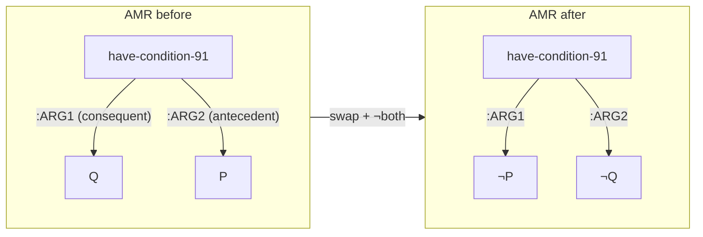

- **Input:** *If the eagle is kind, then the mouse is not clever.*
- **Output:** *If the mouse is clever, the eagle is not kind.*

#### 2. Commutative

**Equivalence:** `A ∧ B ⇔ B ∧ A`, `A ∨ B ⇔ B ∨ A`

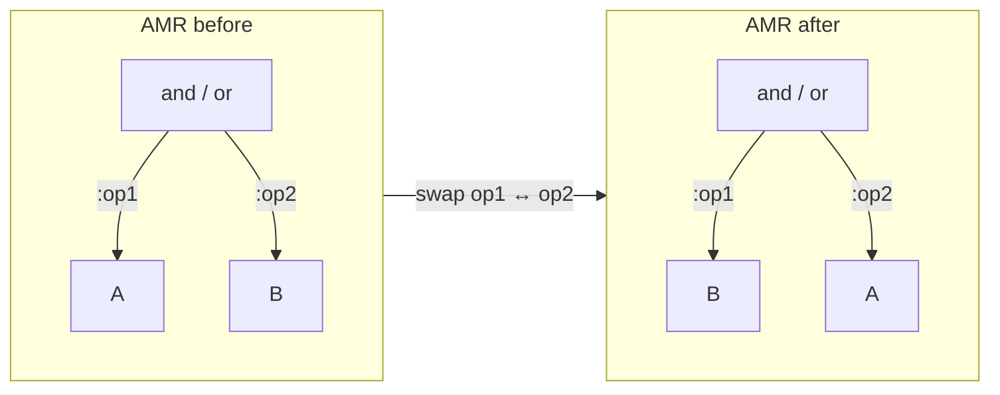

- **Input:** *The eagle is kind and the mouse is clever.*
- **Output:** *The mouse is clever and the eagle is kind.*

#### 3. Implication

**Equivalence:** `P → Q  ⇔  ¬P ∨ Q`

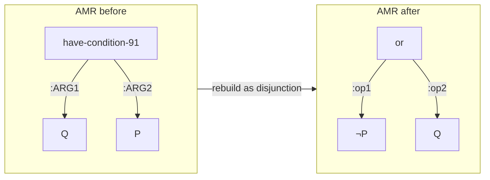

- **Input:** *If the eagle is kind, then the mouse is not clever.*
- **Output:** *The eagle is not kind, or the mouse is not clever.*

#### 4. Double negation

**Equivalence:** `P  ⇔  ¬¬P`

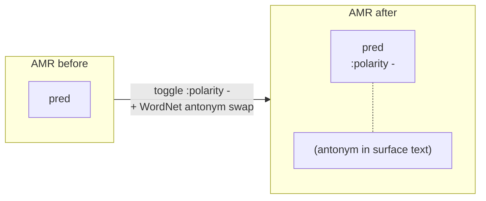

- **Input:** *The bald eagle is beautiful.*
- **Output:** *The bald eagle is not ugly.*

### New rules added by this extension (10)

#### 5. De Morgan

**Equivalence:** `¬(A ∧ B)  ⇔  ¬A ∨ ¬B`,    `¬(A ∨ B)  ⇔  ¬A ∧ ¬B`

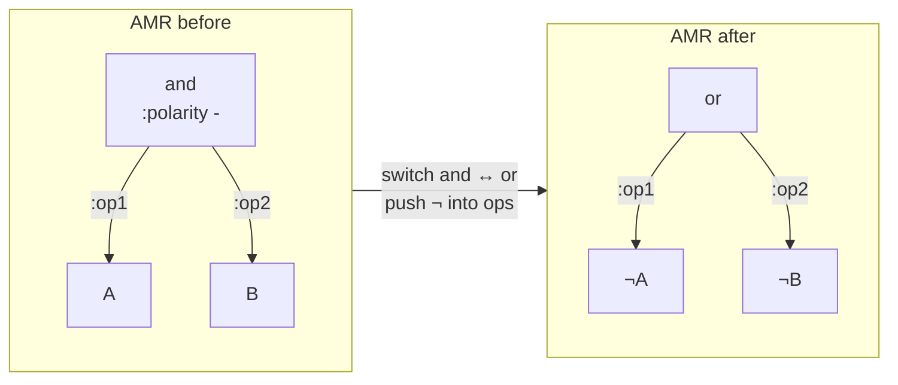

- **Input:** *It is not the case that the manager and the assistant attended the meeting.*
- **Output:** *The manager did not attend the meeting or the assistant did not attend the meeting.*

#### 6. Inverse relation (PropBank frame inversion)

**Equivalence:** `buy(x, y, z)  ⇔  sell(z, y, x)` (and other PropBank inverse pairs)

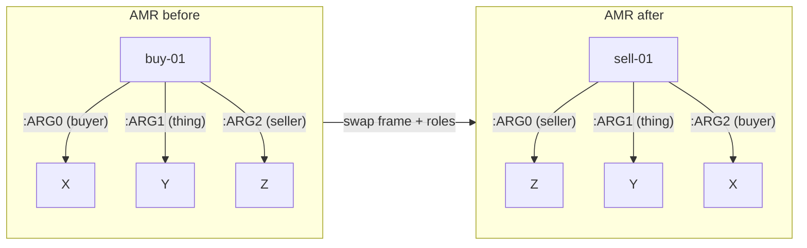

- **Input:** *Alice bought the book from Bob.*
- **Output:** *Bob sold the book to Alice.*

#### 7. Symmetric relation

**Equivalence:** `sibling(x, y)  ⇔  sibling(y, x)` (and other symmetric PropBank frames)

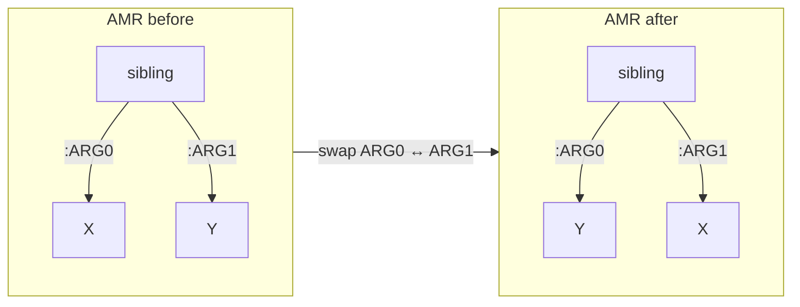

- **Input:** *Alice is a sibling of Bob.*
- **Output:** *Bob is a sibling of Alice.*

#### 8. Asymmetric relation (negative-only)

**Equivalence:** `parent(x, y)  ⇒  ¬parent(y, x)` (used to construct contrastive negatives)

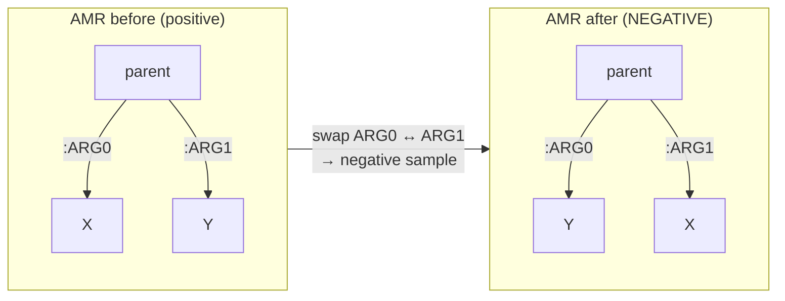

- **Input:** *Alice is a parent of Bob.*
- **Negative output:** *Bob is a parent of Alice.* (used as a contrastive negative)

#### 9. Predicate implication

**Equivalence (one-way):** `kill(x, y)  ⇒  die(y)`, `buy(x, y)  ⇒  have(x, y)` (lexical entailment)

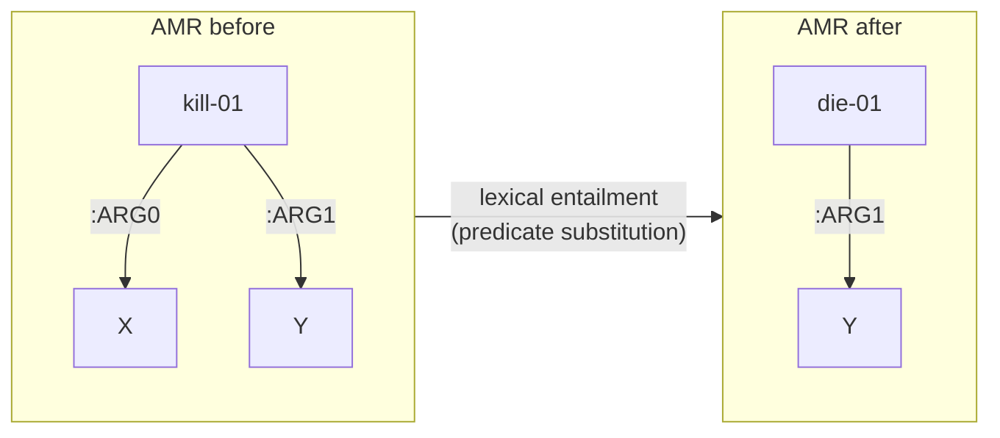

- **Input:** *The hunter killed the deer.*
- **Output:** *The deer died.*

#### 10. Transitivity

**Equivalence:** `a > b  ∧  b > c  ⇒  a > c`

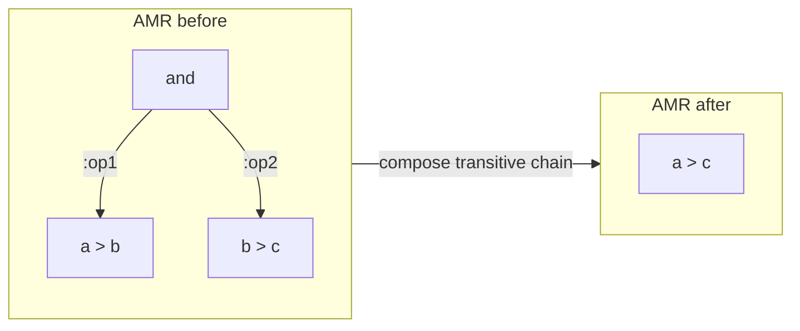

- **Input:** *Alice is taller than Bob, and Bob is taller than Carol.*
- **Output:** *Alice is taller than Carol.*

#### 11. Modal strength inversion

**Equivalence:** `□P  ⇔  ¬◇¬P`,    `◇P  ⇔  ¬□¬P`

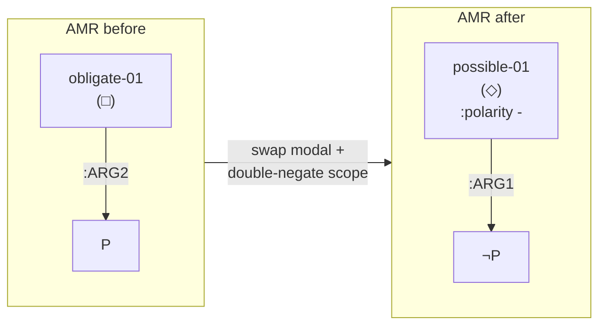

- **Input:** *Alice must finish her homework before dinner.*
- **Output:** *It is not possible that Alice does not finish her homework before dinner.*

#### 12. Aspect equivalence

**Equivalence:** `perfective(eat, x, y)  ⇔  resultative(eaten, y)` (UMR-style aspect overlay)

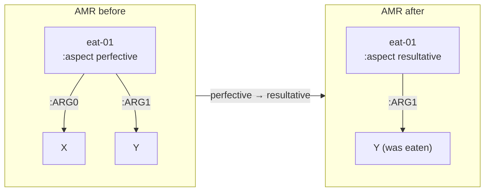

- **Input:** *Alice ate the apple.*
- **Output:** *The apple has been eaten.*

#### 13. Document-level temporal transitivity

**Equivalence:** `before(A, B)  ∧  before(B, C)  ⇒  before(A, C)` (across sentences in a document)

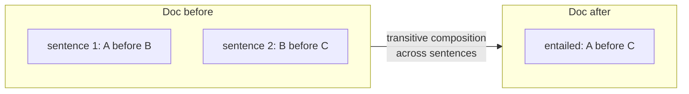

- **Input:** *Alice woke up. Then she had breakfast. Then she left for work.*
- **Output:** *Alice woke up before leaving for work.*

#### 14. Tense transformation

**Equivalence:** `past(P)  ⇔  has-been(perfective(P))`

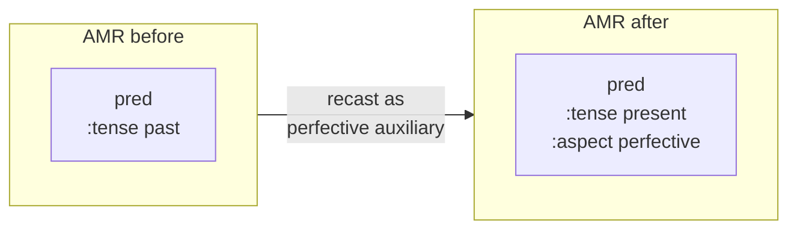

- **Input:** *Alice finished the project.*
- **Output:** *Alice has finished the project.*

## License and citation

Original paper: Bao et al. ACL Findings 2024,
<https://aclanthology.org/2024.findings-acl.353/>. Extension code under
the same license as the upstream repository.
