# AMR-LDA Extension Research

Extension work on top of **Bao et al. (ACL Findings 2024)** —
*Abstract Meaning Representation-Based Logic-Driven Data Augmentation
for Logical Reasoning*.

- **Code repo:** <https://github.com/14H034160212/Logical-Equivalence-driven-AMR-Data-Augmentation-for-Representation-Learning>
- **Base paper:** <https://aclanthology.org/2024.findings-acl.353/>

---

## Key takeaways (jump to evidence)

We teach a model logical reasoning by feeding it many sentence pairs
that mean the same thing. This page is about how to *generate* those
pairs well. Five plain-language findings:

1. **If the sentence generator doesn't make mistakes, the training data
   gets better.** We fixed the generator so it stops dropping the word
   "not" (it used to do this 31% of the time, now 18%). Cleaner data →
   the model scores a bit higher. → [Finding 1](#finding-1)
2. **But making the generator more careful also makes it more
   repetitive — and that hurts harder questions.** Careful generators
   write the same sentence shapes over and over. Simple questions
   (ReClor) don't mind; harder multi-step questions (LogiQA) need
   variety and get worse. We tried **12 different fixes** (including 5
   different big AI models up to 70B) and *none* fixed both at once.
   → [Finding 2](#finding-2)
3. **Using a bigger model to learn from the data makes the problem go
   away.** The small model needed variety; a 4× bigger model doesn't.
   With the big model our best data scores **79.8%** on ReClor — higher
   than the original paper — and the harder benchmark recovers too.
   → [Finding 3](#finding-3)
4. **Watch out: the newest "thinking" AI models can secretly poison
   your data.** Qwen3 wrote its hidden reasoning into our data and
   accidentally copied the answers, faking a 2-point boost. A quick
   check (are the sentences suspiciously long or repetitive?) caught it.
   → [Finding 4](#finding-4)
5. **We propose a new method, LeRC**, that builds variety using logic
   rules instead of a noisy generator. It produces the cleanest data,
   but confirms the real fix is a bigger model, not better data.
   → [§5 LeRC](#lerc)

**Best single result:** **79.8%** on ReClor and **42.24%** on LogiQA —
both beating the original paper's setup. → [Headline numbers](#headline-numbers)

---

**How this page is organized.** §1 Background explains the base
method. §2 states the research questions and defines the two key
terms. §3 presents the four findings, one per research question —
this is the core of the page. §4 collects the headline numbers in one
table. §5 describes LeRC, the algorithm we propose. The appendices
hold the full experiment log and the illustrated gallery of all 14
logic rules.

---

## 1 · Background — what is AMR-LDA?

**Problem.** Encoder models like DeBERTa are stronger at logical
reasoning benchmarks (ReClor, LogiQA) when fine-tuned on contrastive
pairs of *logically equivalent* sentences. But hand-writing such pairs
doesn't scale.

**The base paper's idea** (Bao et al., ACL Findings 2024).
Auto-generate logically equivalent paraphrases via **structural rules
on Abstract Meaning Representation (AMR) graphs**, then turn the
modified AMR back into text. This gives free, large-scale contrastive
training data.

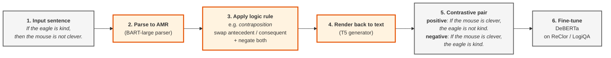
```mermaid
flowchart LR
    S["<b>1. Input sentence</b><br/><i>If the eagle is kind,<br/>then the mouse is not clever.</i>"]
    S --> A["<b>2. Parse to AMR</b><br/>(BART-large parser)"]
    A --> R["<b>3. Apply logic rule</b><br/>e.g. <i>contraposition</i><br/>swap antecedent / consequent<br/>+ negate both"]
    R --> T["<b>4. Render back to text</b><br/>(T5 generator)"]
    T --> O["<b>5. Contrastive pair</b><br/><b>positive</b>: <i>If the mouse is clever,<br/>the eagle is not kind.</i><br/><b>negative</b>: <i>If the mouse is clever,<br/>the eagle is kind.</i>"]
    O --> D["<b>6. Fine-tune</b><br/>DeBERTa<br/>on ReClor / LogiQA"]

    classDef io fill:#f5f5f5,stroke:#616161,stroke-width:2px,font-size:14px
    classDef method fill:#fff3e0,stroke:#e65100,stroke-width:2.5px,font-size:14px
    class S,O,D io
    class A,R,T method
```

**Base paper's reach.** 4 logical-equivalence rules (contraposition,
commutative, implication, double-negation); DeBERTa-v2-xxlarge reaches
~79% on ReClor.

---

## 2 · Research questions

**The broader context.** Synthetic data augmentation is now the
dominant way to teach reasoning to language models — whether the
generator is a rule system, a fine-tuned seq2seq model, or a frontier
LLM. The open scientific question this work attacks: **what makes
synthetic reasoning data good?** We find the answer is a measurable,
structural tension between two properties of the generated text.

### Two key terms

- **Logical fidelity** (逻辑保真度) — does each generated sentence
  preserve the intended logical meaning of its source? Concretely: no
  dropped negations, no flipped quantifiers, no broken `if-then`
  structure.
  *Failure example:* source *"If A, then **not** B"* → generated
  *"If A, then B"* — the negation was silently dropped, so the
  "logically equivalent paraphrase" is actually a contradiction.
  (Earlier reports call this **polarity preservation**; negation loss
  is the most common fidelity failure in practice.)
- **Surface diversity** (表面多样性) — across the *whole corpus*, how
  varied are the words and sentence patterns? Measured by distinct-n
  (fraction of unique n-grams) and near-duplicate rate.
  *Failure example:* 10,000 training pairs that all follow the
  template *"If the ⟨animal⟩ is ⟨adj⟩, then …"* — perfect fidelity,
  but the model overfits the template and fails on differently-phrased
  reasoning problems.

**The trade-off.** Pushing a generator toward higher fidelity
systematically makes its output more templated — fidelity up,
diversity down. We call this the **fidelity–diversity trade-off**.

### The four questions

| # | General question | Instantiation here |
|---|---|---|
| **RQ1 Coverage** | Does broader symbolic knowledge improve synthetic reasoning data? | Grow the rule library 4 → 14; fix a soundness bug; fine-tune the generator for fidelity |
| **RQ2 Trade-off** | Is the fidelity–diversity trade-off removable, and which tasks pay for it? | 12 mitigation attempts across three families (dataset recombination, symbolic composition, generator replacement up to 70B) |
| **RQ3 Scale** | Is diversity-sensitivity a property of the data or of the consumer model? | Same corpora, downstream encoder 400M → 1.5B |
| **RQ4 Trust** | What silent failure modes do reasoning-LLM generators introduce, and what catches them? | Qwen3 thinking-trace contamination, caught by a corpus diversity audit |

These questions are deliberately **not specific to AMR-LDA**: they
apply to any synthetic-data pipeline (chain-of-thought distillation,
instruction generation, rule-based augmentation). AMR-LDA is the
controlled testbed because logical fidelity is symbolically checkable.

---

## 3 · Findings

**Corpus naming convention** (used in every table below): each
training corpus is named after how it was generated —

| Name | Meaning |
|---|---|
| `Stock-T5` | base paper's corpus: rules + unmodified T5 renderer |
| `Fidelity-T5` | same rules, T5 fine-tuned to stop dropping negations |
| `Sampled-T5 (+filter)` | temperature-sampled T5, optionally with a fidelity filter |
| `Para-⟨LLM⟩` | `Fidelity-T5` positives re-paraphrased by the named LLM (e.g. `Para-Qwen-8B`) |
| `LeRC` | our rule-composition algebra ([§5](#5--proposed-algorithm--lerc)) |

(Internal artifact IDs like `v6` map to these names in
[Appendix A](#appendix-a--full-experiment-log).)

### Finding 1 — Richer rules + a faithful generator work (RQ1 ✅) {#finding-1}

We extended the rule library from 4 to **14 logical-equivalence
rules** (De Morgan, transitivity, symmetric/asymmetric, predicate
implication, inverse relation, modal duality, aspect, doc-level
temporal, tense — illustrated in [Appendix B](#appendix-b--rule-gallery-14-logical-equivalence-rules)),
fixed a soundness bug in contraposition over conjunctive antecedents
(`¬(A ∧ B) → ¬A ∨ ¬B` was not being distributed), and iteratively
fine-tuned the AMR-to-text generator on its own failure cases.

| Fidelity metric | Before | After |
|---|---|---|
| Pilot self-check pass rate | 68.9% | **82.2%** |
| Contraposition pilot | 8/15 | **15/15** |
| Held-out PARARULE-Plus Depth5 | 70.6% | **73.4%** |

The resulting `Fidelity-T5` corpus also beats `Stock-T5` downstream on
ReClor: **63.5% vs 62.9%** (mean of 2 seeds, DeBERTa-large), and wins
LogiQA *test* 42.24% vs 36.56%.

### Finding 2 — The fidelity–diversity trade-off is structural at small scale (RQ2 🔴) {#finding-2}

The fidelity win comes at a measured diversity cost: the cleaned
generator's corpus has **26% fewer distinct unigrams** and a higher
near-duplicate rate than the stock corpus. The cost lands asymmetrically:
**ReClor (single-step entailment) improves, LogiQA (multi-step
deduction) at first regresses** — multi-step reasoning needs surface
variety to generalize across phrasings.

We then tried to break the trade-off **12 ways across three
families**. Scores are ReClor dev / LogiQA test on DeBERTa-large
(multi-seed means where available; baseline = `Fidelity-T5`
at 63.5 / 42.24):

| Family | Corpus | ReClor dev | LogiQA test | Verdict |
|---|---|---|---|---|
| *Dataset recombination* | `Fidelity-T5 + LegacyDNeg` (re-add old double-negation rows) | 63.0 | 36.41 | ❌ |
| | `Mix(Stock, Fidelity)` | 62.4 | 36.41 | ❌ |
| | `Sampled-T5` (no filter) | 59.6 | 27.19 | ❌ collapses |
| | `Sampled-T5 + PolarityFilter` | 59.8 | 30.11 | ❌ |
| | `Sampled-T5 + AMRFilter` (struct-F1) | 60.8 | 35.33 | ❌ |
| *Symbolic composition* | **`LeRC`** (ours, [§5](#5--proposed-algorithm--lerc)) | 61.2 | 35.48 | ❌ at dataset layer |
| | `LeRC + Para-Qwen` | 62.8 | 34.87 | ❌ redundant |
| *Generator replacement* | `Para-Llama-8B` | 64.4 | 37.48 | 🟡 ReClor +0.9 |
| | **`Para-Qwen-8B`** (thinking disabled) | **65.1** | 33.4 | 🟡 best ReClor, worst LogiQA |
| | `Para-Llama-70B` (4-bit) | 64.7 | 33.1 | 🟡 |
| | `Para-Gemma-4B` (E4B MoE) | 65.0 | **37.94** | 🟡 best LLM on LogiQA |
| | `Para-Gemma-31B` (4-bit) | 64.4 | 35.64 | 🟡 worse than its 4B sibling |

Three robust observations:

1. **Every LLM paraphrase improves ReClor** (+0.9 to +1.6 pp) — the
   generator, not the rules, was the ReClor bottleneck.
2. **Nothing recovers LogiQA at 400M.** All 12 attempts stay below
   `Fidelity-T5`'s 42.24% test accuracy.
3. **Bigger LLM ≠ better data.** `Para-Gemma-4B` beats `Para-Gemma-31B`
   on both tasks; `Para-Qwen-8B` matches `Para-Llama-70B` on ReClor.
   The ReClor-best LLM (Qwen) is the LogiQA-worst — no universal winner.

### Finding 3 — Scale dissolves the trade-off (RQ3 ✅) {#finding-3}

Same corpora, downstream encoder scaled from DeBERTa-large (400M) to
DeBERTa-v2-xxlarge (1.5B):

| Corpus → backbone | ReClor dev | LogiQA test |
|---|---|---|
| `Para-Qwen-8B` → 400M | 65.1 | 33.4 |
| `Para-Qwen-8B` → **1.5B** | **79.8** ⭐ | **41.01** |
| (`Fidelity-T5` → 1.5B, matched recipe) | 64.8 | — |
| (published paper xxlarge, reference) | 78.8 | — |

At 1.5B `Para-Qwen-8B` delivers **+15.0 pp on ReClor over
the matched-recipe baseline, beats the published paper number**
(79.8 vs 78.8), *and* nearly closes the LogiQA gap (41.01 vs 42.24
best). **The diversity tax is paid by small consumer models; a larger
encoder no longer needs the surface variety.** This reframes the
trade-off as a small-model phenomenon.

Zero-shot external transfer confirms the pattern (AGIEval LSAT,
5-option, no LSAT training):

| Checkpoint | LSAT-AR | LSAT-LR (all) | LSAT-RC | Macro |
|---|---|---|---|---|
| `Fidelity-T5`, 400M | 20.43 | 70.78 | 40.15 | 43.79 |
| `Para-Qwen-8B`, 400M | 20.87 | 78.04 | 32.71 | 43.87 |
| `Para-Qwen-8B`, **1.5B** | 25.65 | 90.78 | 48.33 | **54.92** |

**Overlap audit (important).** ReClor is built from LSAT/GMAT
questions, so we quantified the overlap: **73.7% of AGIEval LSAT-LR
items appear in ReClor train+val** (189/510 exact duplicates by
normalized containment + 187/510 near-duplicates at Jaccard ≥ 0.8).
LSAT-AR and LSAT-RC have **zero** overlap. The honest LSAT-LR numbers
are therefore the **clean-subset** ones (134 truly unseen items):

| Checkpoint | Overlap subset (376) | **Clean subset (134)** |
|---|---|---|
| `Fidelity-T5`, 400M | 76.06 | **55.97** |
| `Para-Qwen-8B`, 400M | 88.83 | **47.76** |
| `Para-Qwen-8B`, **1.5B** | 94.95 | **79.10** ⭐ |

Three corrections this audit forces:

1. The previously-reported 90.78% was inflated by training-question
   overlap; the genuine zero-shot number is **79.1%** — still strong,
   and consistent with the model's 79.8% ReClor dev.
2. **At 400M, the apparent LLM-corpus win on LSAT-LR was entirely
   memorization**: on overlap items `Para-Qwen-8B` scores 88.8 vs
   76.1 (better recall of ReClor training questions), but on clean
   items it *loses* to `Fidelity-T5` 47.8 vs 56.0 —
   the same fidelity–diversity asymmetry as LogiQA, now visible on
   truly unseen data.
3. The scale effect survives the audit: clean-subset accuracy jumps
   47.8 → 79.1 from 400M → 1.5B.

LSAT-AR (constraint-solving "logic games") stays near the 20% chance
level for all checkpoints, consistent with the literature. Partitioned
JSONs: [`agieval_lsatlr_partitioned_xxlarge.json`](agieval_lsatlr_partitioned_xxlarge.json) ·
[`agieval_lsatlr_partitioned_large_qwen3.json`](agieval_lsatlr_partitioned_large_qwen3.json) ·
[`agieval_lsatlr_partitioned_large_v6.json`](agieval_lsatlr_partitioned_large_v6.json).

### Finding 4 — Reasoning-LLM corpora need auditing (RQ4 ⚠️) {#finding-4}

Our first Qwen3 corpus produced a suspicious ReClor jump (67.0%).
Investigation: Qwen3's default chat template emits `<think>` reasoning
traces; with an 80-token generation cap our pipeline captured **only
the trace** — which *quoted the reference paraphrase verbatim* (label
leakage worth ~2 pp).

**What caught it:** a corpus-level diversity audit. The contaminated
corpus was a flagrant outlier *before* any training:

| Corpus | distinct-3 | near-dup rate | avg words/sentence |
|---|---|---|---|
| Normal LLM paraphrase corpora | 0.17 – 0.29 | 0.4 – 2.2% | 9 – 10 |
| **Contaminated Qwen3 corpus** | **0.07** | **58.2%** | **34.1** |

Fix: probe the chat template for `enable_thinking=False` support and
strip residual `</think>` blocks
([`build_v13_llm_paraphrase.py`](https://github.com/14H034160212/Logical-Equivalence-driven-AMR-Data-Augmentation-for-Representation-Learning/blob/main/extensions/pilot_study/build_v13_llm_paraphrase.py)).
Corrected result: 65.1%, not 67.0. Full diversity numbers:
[`diversity_5llm.json`](diversity_5llm.json).

**Recommendation:** treat a cheap diversity audit (sentence length,
distinct-n, near-dup rate) as a standard sanity gate for any
LLM-generated corpus. The same pitfall awaits DeepSeek-R1 / o1-style
generators.

---

## 4 · Headline numbers {#headline-numbers}

| Benchmark | Best configuration | Score | Notes |
|---|---|---|---|
| **ReClor dev** | `Para-Qwen-8B` → DeBERTa-v2-xxlarge | **79.8%** ⭐ | beats the published xxlarge number (78.8) |
| ReClor dev (400M, multi-seed) | `Para-Qwen-8B` → DeBERTa-large | 65.1% | mean of seeds 21/42 |
| **LogiQA test** | `Fidelity-T5` → DeBERTa-large | **42.24%** | local labels (651 examples) |
| LogiQA test (1.5B) | `Para-Qwen-8B` → DeBERTa-v2-xxlarge | 41.01% | trade-off nearly closed at scale |
| **AGIEval LSAT-LR** (zero-shot, clean subset) | `Para-Qwen-8B` → DeBERTa-v2-xxlarge | **79.10%** | 134 items verified non-overlapping with ReClor; full-set 90.78% is overlap-inflated |
| PARARULE-Plus Depth5 (held-out) | Fidelity-tuned generator + rule fix | 73.4% | generator pass rate |

**Why ReClor reports dev only.** The official ReClor test leaderboard
(EvalAI challenge 503) **closed permanently on 2026-01-16**; AI2's
leaderboard infrastructure (ARC / OpenBookQA / CommonsenseQA /
HellaSwag) is also offline. The community has shifted to public-label
evaluation (lm-evaluation-harness convention); we follow it. All test
predictions are archived under
[`submissions/`](https://github.com/14H034160212/Logical-Equivalence-driven-AMR-Data-Augmentation-for-Representation-Learning/tree/main/submissions)
in case a successor leaderboard opens.

---

## 5 · Proposed algorithm — LeRC {#lerc}

**Logic-Equivalent Rule Composition.** The dataset-level mitigations
in Finding 2 all source diversity from *stochastic decoding*, which
re-introduces fidelity noise that filters can't fully catch. LeRC
instead sources diversity from the **logic layer**: treat the 14
rules as an algebra of equivalence-preserving operators and **compose**
them — for each anchor, apply K different rule compositions to produce
K structurally distinct but provably equivalent AMRs, then render each.
No sampling, no filter; correctness holds by construction.

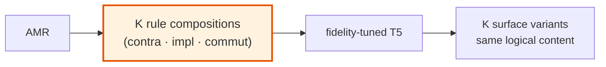
```mermaid
flowchart LR
    A["AMR"] --> P["K rule compositions<br/>(contra · impl · commut)"]
    P --> T["fidelity-tuned T5"]
    T --> K["K surface variants<br/>same logical content"]

    classDef new fill:#fff3e0,stroke:#e65100,stroke-width:2.5px,font-size:18px
    class P new
```

**Result.** LeRC's corpus is the most *learnable* (99.80% contrastive
eval, highest of any backbone) but downstream it ties the
filter-based mitigations (61.2 / 35.48) — and composing LeRC with LLM
paraphrase is redundant (62.8 / 34.87). **Diagnosis:** the K
compositions are few (5 templates) and regular; the downstream model
learns the template shapes rather than the logical content, and the
rendering decoder remains the diversity bottleneck. LeRC marks the
ceiling of dataset-layer fixes — consistent with Finding 3, where the
real unlock was consumer-model scale. Details:
[V14_LERC_RESULTS.md](V14_LERC_RESULTS.md).

---

## Appendix A — full experiment log

The page uses the corpus names below; checkpoints, W&B runs, and JSON
aggregates on disk use the internal IDs (second column).

| Corpus name | Internal ID | ReClor dev | LogiQA test | Links |
|---|---|---|---|---|
| `Stock-T5` | `v5` | 62.8 / 63.0 — mean 62.9 | 36.56 | [`v6_reclor_multiseed.json`](v6_reclor_multiseed.json) |
| `Fidelity-T5` | `v6` | 63.6 / 63.4 — mean 63.5 | **42.24** | [`V6_RECLOR_MULTISEED.md`](V6_RECLOR_MULTISEED.md) · [`V6_LOGIQA_MULTISEED.md`](V6_LOGIQA_MULTISEED.md) |
| `Fidelity-T5 + RuleFix` | `v7` | 63.6 | 42.24 | [`V7_DOWNSTREAM.md`](V7_DOWNSTREAM.md) |
| `Fidelity-T5 + LegacyDNeg` | `v8` | 63.0 | 36.41 | [`V8_DOUBLENEG_REINTRO.md`](V8_DOUBLENEG_REINTRO.md) |
| `Sampled-T5` | `v9` | 59.6 | 27.19 | [`V9_SAMPLED_NEGATIVE.md`](V9_SAMPLED_NEGATIVE.md) |
| `Mix(Stock, Fidelity)` | `v10` | 62.4 | 36.41 | [`V10_MIX_NEGATIVE.md`](V10_MIX_NEGATIVE.md) |
| `Sampled-T5 + PolarityFilter` | `v11` | 59.8 | 30.11 | [`V11_VERIFIED_NEGATIVE.md`](V11_VERIFIED_NEGATIVE.md) |
| `Sampled-T5 + AMRFilter` | `v12` | 60.8 | 35.33 | [`V12_V1VERIFIER.md`](V12_V1VERIFIER.md) |
| `Para-Llama-8B` | `v13_llama` | 64.4 | 37.48 | [W&B](https://wandb.ai/qbao775/amr-lda-extensions/runs/1ydkhzku) |
| ⚠️ `Para-Qwen-8B` contaminated — do not cite | `v13_qwen3` | (67.0) | (32.72) | see Finding 4 |
| `Para-Qwen-8B` | `v13_qwen3_clean` | 66.2 / 64.0 — mean **65.1** | 35.02 / 31.80 — mean 33.4 | W&B `v13_qwen3_clean_*` |
| `Para-Llama-70B` (4-bit) | `v13_llama70` | 66.6 / 62.8 — mean 64.7 | 33.64 / 32.57 — mean 33.1 | W&B `v13_llama70_*` |
| `Para-Gemma-4B` (E4B MoE) | `v13_gemma4_4b` | 65.0 | 37.94 | W&B `v13_gemma4_4b_*` |
| `Para-Gemma-31B` (4-bit) | `v13_gemma4_31b` | 64.4 | 35.64 | W&B `v13_gemma4_31b_*` |
| `LeRC` | `v14` | 61.2 | 35.48 | [`V14_LERC_RESULTS.md`](V14_LERC_RESULTS.md) |
| `LeRC + Para-Qwen` | `v15` | 62.0 / 63.6 — mean 62.8 | 35.94 / 33.79 — mean 34.87 | W&B `v15_*` |

Generator fine-tune iterations (internal IDs `v1`–`v4` are *generator*
versions, distinct from corpus IDs above): v1 389 silver pairs → 52.2%
subset pass; v2 +curated golds → 56.5%; v3 +synthetic golds → 69.6%;
v4 +anchor golds → 73.9% subset / 78.9% full; +De Morgan rule fix →
82.2%. The `Fidelity-T5` corpus is rendered by the v4 generator.
Reports: [`T5_FT_RECOVERY.md`](T5_FT_RECOVERY.md) ·
[`RULEFIX_DEMORGAN.md`](RULEFIX_DEMORGAN.md).

xxlarge runs: `Stock-T5` collapsed (24.4 final); `Fidelity-T5` stable
64.8; `Para-Qwen-8B` **79.8** / LogiQA test 41.01.
[`V_XXLARGE_DELTA.md`](V_XXLARGE_DELTA.md).

AGIEval: [`agieval_lsat_large_v6.json`](agieval_lsat_large_v6.json) ·
[`agieval_lsat_large_v13_qwen3_clean.json`](agieval_lsat_large_v13_qwen3_clean.json) ·
[`agieval_lsat_xxlarge_v13_qwen3_clean.json`](agieval_lsat_xxlarge_v13_qwen3_clean.json) ·
script [`eval_agieval_lsat.py`](https://github.com/14H034160212/Logical-Equivalence-driven-AMR-Data-Augmentation-for-Representation-Learning/blob/main/extensions/pilot_study/eval_agieval_lsat.py).

Diversity: [`DIVERSITY_ROOT_CAUSE.md`](DIVERSITY_ROOT_CAUSE.md) ·
[`DIVERSITY_FINAL.md`](DIVERSITY_FINAL.md) ·
[`diversity_5llm.json`](diversity_5llm.json).

Side thread (not in the headline path): a GRPO RL proof-of-concept
using the AMR verifier as reward signal — Qwen2.5-3B + LoRA reaches
reward 0.94 in 13 min ([`GRPO_3B_RESULTS.md`](GRPO_3B_RESULTS.md));
plumbing it into the corpus is future work.

Figures:

---

## Appendix B — Rule gallery: 14 logical-equivalence rules

The original ACL Findings 2024 paper implemented 4 rules; this
extension adds 10 more. Each rule is a structural transformation on
the AMR graph that preserves logical equivalence. For every rule
below: a formal equivalence statement, an AMR transformation diagram,
and a concrete English example.

Code: each rule is one subclass of `LogicRule` in
[`extensions/logic_rules/`](https://github.com/14H034160212/Logical-Equivalence-driven-AMR-Data-Augmentation-for-Representation-Learning/tree/main/extensions/logic_rules).

### Original paper rules (4)

#### 1. Contraposition

**Equivalence:** `P → Q  ⇔  ¬Q → ¬P`

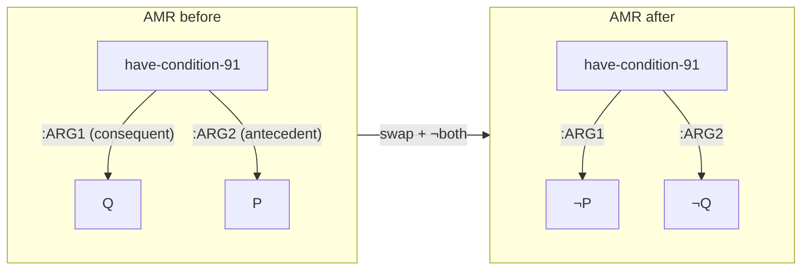
```mermaid
flowchart LR
    subgraph BEF["AMR before"]
        H1["have-condition-91"] -->|":ARG1 (consequent)"| Q1["Q"]
        H1 -->|":ARG2 (antecedent)"| P1["P"]
    end
    BEF -->|"swap + ¬both"| AFT
    subgraph AFT["AMR after"]
        H2["have-condition-91"] -->|":ARG1"| nP["¬P"]
        H2 -->|":ARG2"| nQ["¬Q"]
    end
```

- **Input:** *If the eagle is kind, then the mouse is not clever.*
- **Output:** *If the mouse is clever, the eagle is not kind.*

#### 2. Commutative

**Equivalence:** `A ∧ B ⇔ B ∧ A`, `A ∨ B ⇔ B ∨ A`

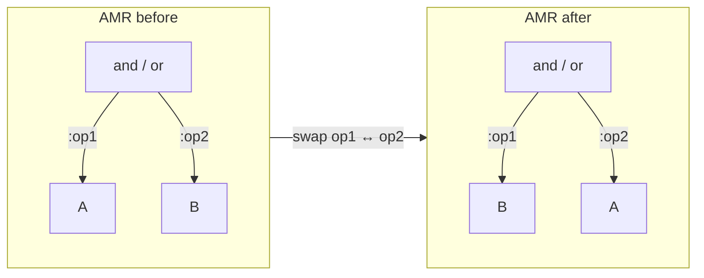
```mermaid
flowchart LR
    subgraph BEF["AMR before"]
        N1["and / or"] -->|":op1"| A1["A"]
        N1 -->|":op2"| B1["B"]
    end
    BEF -->|"swap op1 ↔ op2"| AFT
    subgraph AFT["AMR after"]
        N2["and / or"] -->|":op1"| B2["B"]
        N2 -->|":op2"| A2["A"]
    end
```

- **Input:** *The eagle is kind and the mouse is clever.*
- **Output:** *The mouse is clever and the eagle is kind.*

#### 3. Implication

**Equivalence:** `P → Q  ⇔  ¬P ∨ Q`

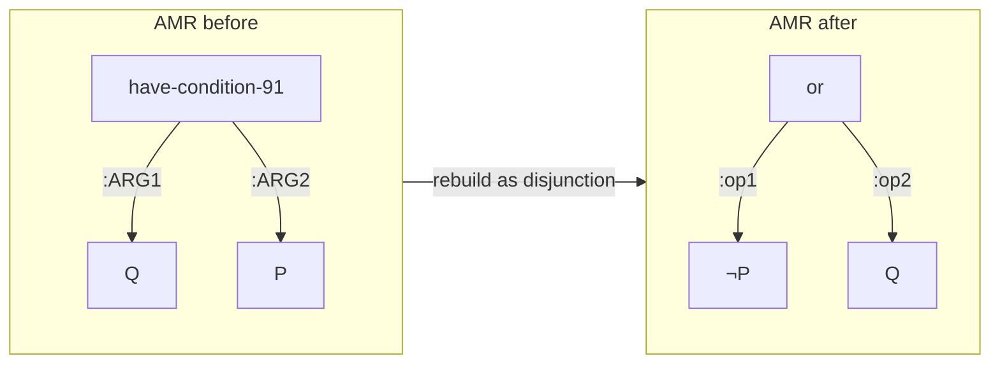
```mermaid
flowchart LR
    subgraph BEF["AMR before"]
        H1["have-condition-91"] -->|":ARG1"| Q1["Q"]
        H1 -->|":ARG2"| P1["P"]
    end
    BEF -->|"rebuild as disjunction"| AFT
    subgraph AFT["AMR after"]
        O["or"] -->|":op1"| nP["¬P"]
        O -->|":op2"| Q2["Q"]
    end
```

- **Input:** *If the eagle is kind, then the mouse is not clever.*
- **Output:** *The eagle is not kind, or the mouse is not clever.*

#### 4. Double negation

**Equivalence:** `P  ⇔  ¬¬P`

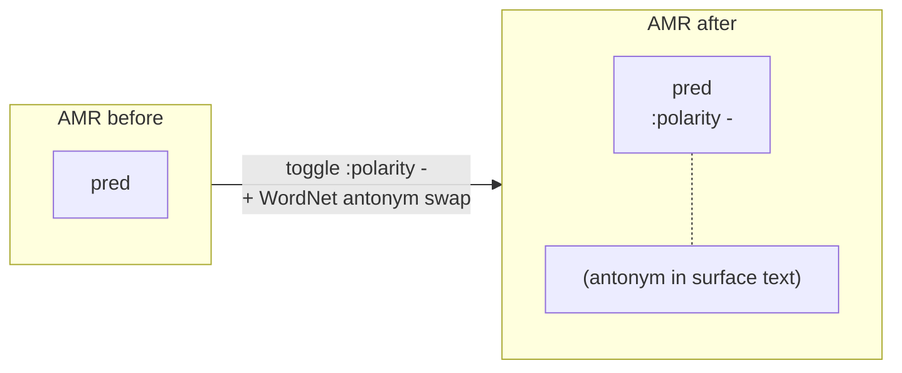
```mermaid
flowchart LR
    subgraph BEF["AMR before"]
        N1["pred"]
    end
    BEF -->|"toggle :polarity -<br/>+ WordNet antonym swap"| AFT
    subgraph AFT["AMR after"]
        N2["pred<br/>:polarity -"] -.- ANT["(antonym in surface text)"]
    end
```

- **Input:** *The bald eagle is beautiful.*
- **Output:** *The bald eagle is not ugly.*

### New rules added by this extension (10)

#### 5. De Morgan

**Equivalence:** `¬(A ∧ B)  ⇔  ¬A ∨ ¬B`,    `¬(A ∨ B)  ⇔  ¬A ∧ ¬B`

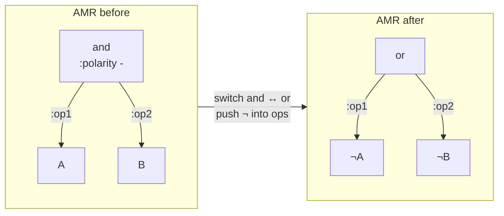
```mermaid
flowchart LR
    subgraph BEF["AMR before"]
        N1["and<br/>:polarity -"] -->|":op1"| A1["A"]
        N1 -->|":op2"| B1["B"]
    end
    BEF -->|"switch and ↔ or<br/>push ¬ into ops"| AFT
    subgraph AFT["AMR after"]
        N2["or"] -->|":op1"| A2["¬A"]
        N2 -->|":op2"| B2["¬B"]
    end
```

- **Input:** *It is not the case that the manager and the assistant attended the meeting.*
- **Output:** *The manager did not attend the meeting or the assistant did not attend the meeting.*

#### 6. Inverse relation (PropBank frame inversion)

**Equivalence:** `buy(x, y, z)  ⇔  sell(z, y, x)` (and other PropBank inverse pairs)

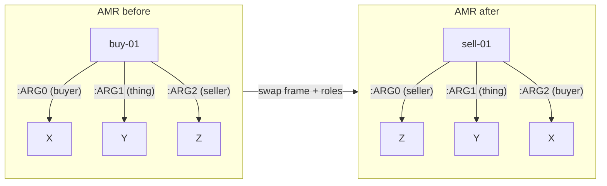
```mermaid
flowchart LR
    subgraph BEF["AMR before"]
        B["buy-01"] -->|":ARG0 (buyer)"| X1["X"]
        B -->|":ARG1 (thing)"| Y1["Y"]
        B -->|":ARG2 (seller)"| Z1["Z"]
    end
    BEF -->|"swap frame + roles"| AFT
    subgraph AFT["AMR after"]
        S["sell-01"] -->|":ARG0 (seller)"| Z2["Z"]
        S -->|":ARG1 (thing)"| Y2["Y"]
        S -->|":ARG2 (buyer)"| X2["X"]
    end
```

- **Input:** *Alice bought the book from Bob.*
- **Output:** *Bob sold the book to Alice.*

#### 7. Symmetric relation

**Equivalence:** `sibling(x, y)  ⇔  sibling(y, x)` (and other symmetric PropBank frames)

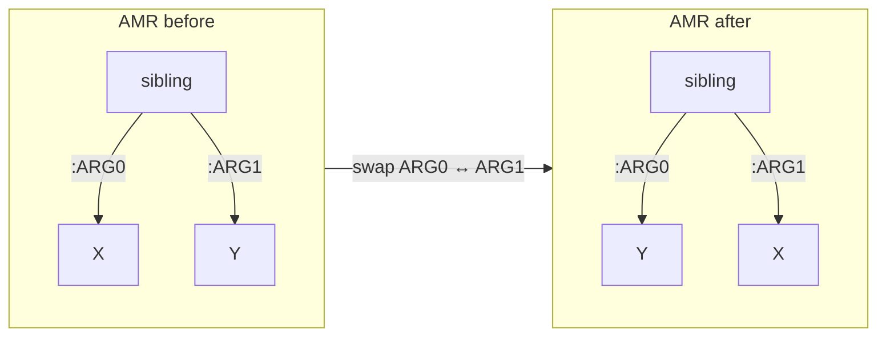
```mermaid
flowchart LR
    subgraph BEF["AMR before"]
        S1["sibling"] -->|":ARG0"| X1["X"]
        S1 -->|":ARG1"| Y1["Y"]
    end
    BEF -->|"swap ARG0 ↔ ARG1"| AFT
    subgraph AFT["AMR after"]
        S2["sibling"] -->|":ARG0"| Y2["Y"]
        S2 -->|":ARG1"| X2["X"]
    end
```

- **Input:** *Alice is a sibling of Bob.*
- **Output:** *Bob is a sibling of Alice.*

#### 8. Asymmetric relation (negative-only)

**Equivalence:** `parent(x, y)  ⇒  ¬parent(y, x)` (used to construct contrastive negatives)

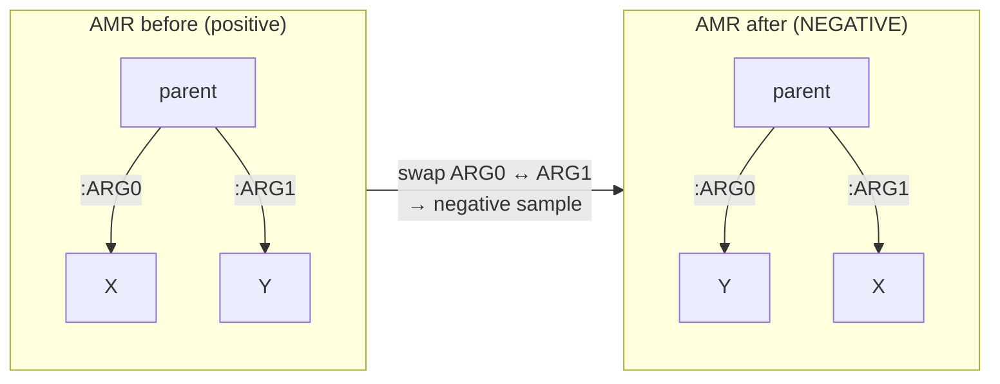
```mermaid
flowchart LR
    subgraph BEF["AMR before (positive)"]
        P1["parent"] -->|":ARG0"| X1["X"]
        P1 -->|":ARG1"| Y1["Y"]
    end
    BEF -->|"swap ARG0 ↔ ARG1<br/>→ negative sample"| AFT
    subgraph AFT["AMR after (NEGATIVE)"]
        P2["parent"] -->|":ARG0"| Y2["Y"]
        P2 -->|":ARG1"| X2["X"]
    end
```

- **Input:** *Alice is a parent of Bob.*
- **Negative output:** *Bob is a parent of Alice.* (used as a contrastive negative)

#### 9. Predicate implication

**Equivalence (one-way):** `kill(x, y)  ⇒  die(y)`, `buy(x, y)  ⇒  have(x, y)` (lexical entailment)

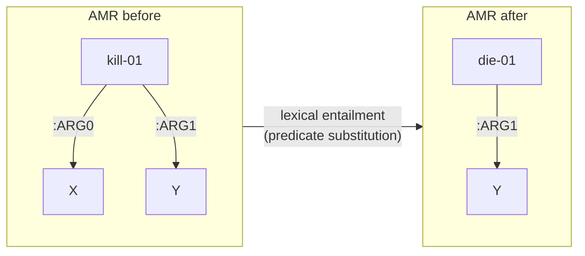
```mermaid
flowchart LR
    subgraph BEF["AMR before"]
        K["kill-01"] -->|":ARG0"| X1["X"]
        K -->|":ARG1"| Y1["Y"]
    end
    BEF -->|"lexical entailment<br/>(predicate substitution)"| AFT
    subgraph AFT["AMR after"]
        D["die-01"] -->|":ARG1"| Y2["Y"]
    end
```

- **Input:** *The hunter killed the deer.*
- **Output:** *The deer died.*

#### 10. Transitivity

**Equivalence:** `a > b  ∧  b > c  ⇒  a > c`

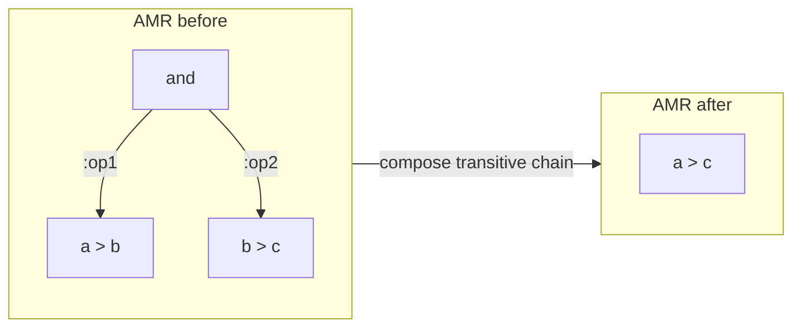
```mermaid
flowchart LR
    subgraph BEF["AMR before"]
        AND["and"] -->|":op1"| F1["a > b"]
        AND -->|":op2"| F2["b > c"]
    end
    BEF -->|"compose transitive chain"| AFT
    subgraph AFT["AMR after"]
        F3["a > c"]
    end
```

- **Input:** *Alice is taller than Bob, and Bob is taller than Carol.*
- **Output:** *Alice is taller than Carol.*

#### 11. Modal strength inversion

**Equivalence:** `□P  ⇔  ¬◇¬P`,    `◇P  ⇔  ¬□¬P`

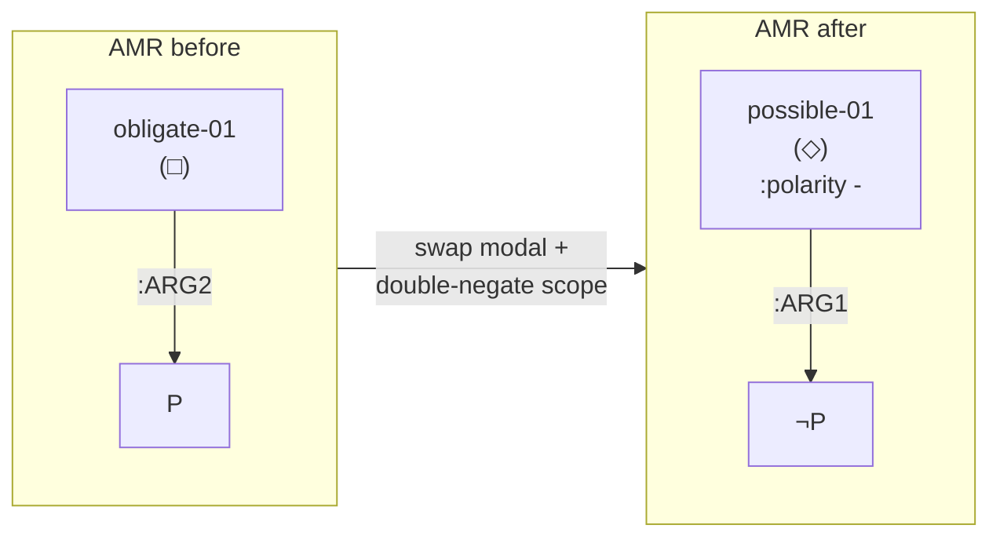
```mermaid
flowchart LR
    subgraph BEF["AMR before"]
        N1["obligate-01<br/>(□)"] -->|":ARG2"| P1["P"]
    end
    BEF -->|"swap modal +<br/>double-negate scope"| AFT
    subgraph AFT["AMR after"]
        N2["possible-01<br/>(◇)<br/>:polarity -"] -->|":ARG1"| P2["¬P"]
    end
```

- **Input:** *Alice must finish her homework before dinner.*
- **Output:** *It is not possible that Alice does not finish her homework before dinner.*

#### 12. Aspect equivalence

**Equivalence:** `perfective(eat, x, y)  ⇔  resultative(eaten, y)` (UMR-style aspect overlay)

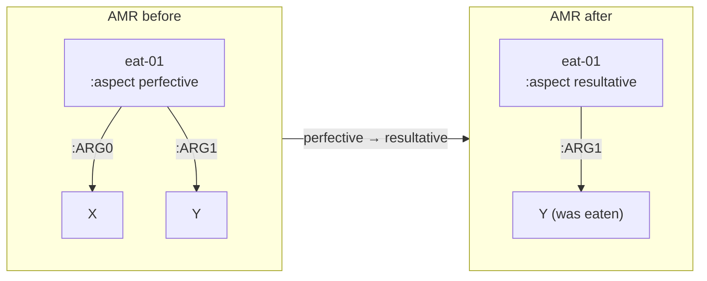
```mermaid
flowchart LR
    subgraph BEF["AMR before"]
        E1["eat-01<br/>:aspect perfective"] -->|":ARG0"| X1["X"]
        E1 -->|":ARG1"| Y1["Y"]
    end
    BEF -->|"perfective → resultative"| AFT
    subgraph AFT["AMR after"]
        E2["eat-01<br/>:aspect resultative"] -->|":ARG1"| Y2["Y (was eaten)"]
    end
```

- **Input:** *Alice ate the apple.*
- **Output:** *The apple has been eaten.*

#### 13. Document-level temporal transitivity

**Equivalence:** `before(A, B)  ∧  before(B, C)  ⇒  before(A, C)` (across sentences in a document)

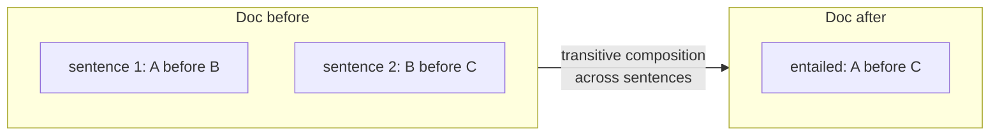
```mermaid
flowchart LR
    subgraph BEF["Doc before"]
        S1["sentence 1: A before B"]
        S2["sentence 2: B before C"]
    end
    BEF -->|"transitive composition<br/>across sentences"| AFT
    subgraph AFT["Doc after"]
        S3["entailed: A before C"]
    end
```

- **Input:** *Alice woke up. Then she had breakfast. Then she left for work.*
- **Output:** *Alice woke up before leaving for work.*

#### 14. Tense transformation

**Equivalence:** `past(P)  ⇔  has-been(perfective(P))`

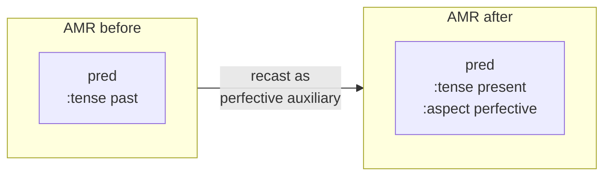
```mermaid
flowchart LR
    subgraph BEF["AMR before"]
        E1["pred<br/>:tense past"]
    end
    BEF -->|"recast as<br/>perfective auxiliary"| AFT
    subgraph AFT["AMR after"]
        E2["pred<br/>:tense present<br/>:aspect perfective"]
    end
```

- **Input:** *Alice finished the project.*
- **Output:** *Alice has finished the project.*

---

## License and citation

Original paper: Bao et al. ACL Findings 2024,
<https://aclanthology.org/2024.findings-acl.353/>. Extension code is
under the same license as the upstream repository.
