# AMR-LDA Extension Research

Extension work on top of **Bao et al. (ACL Findings 2024)** —
*Abstract Meaning Representation-Based Logic-Driven Data Augmentation
for Logical Reasoning*. This site presents every contribution and
experimental result in the extension thread.

- **Code repo:** <https://github.com/14H034160212/Logical-Equivalence-driven-AMR-Data-Augmentation-for-Representation-Learning>
- **Base paper:** Bao et al., ACL Findings 2024 —
  <https://aclanthology.org/2024.findings-acl.353/>

---

## TL;DR

We replaced the AMR-to-text decoder, fixed a bug in the rule library,
added 10 new logical-equivalence rules, and propose a new algorithm
(**LeRC**, Logic-Equivalent Rule Composition). We then conducted a
**five-LLM paraphrase ablation** (Llama-3.1 8B, Qwen3 8B, Llama-3.3
70B, Gemma 4 E4B, Gemma 4 31B) — spanning 4B to 70B parameter range,
3 model families. Multi-seed (seed=21, 42) results below are the
**honest paper headline numbers**.

Headline findings:

- **Best LLM paraphrase backbone**: `v13_qwen3_clean` (Qwen3 8B with
  `enable_thinking=False`) — ReClor dev mean of 2 seeds: **65.1%**
  (+1.6 pp over `v6`). Llama-3.3 70B is statistically tied at 64.7%.
- **`v6` PolarityFix (v4 T5)** still wins **LogiQA test (42.24%)** —
  no LLM paraphrase, large or small, can beat it on LogiQA.
- **Bigger ≠ better**: Gemma 4 E4B (4B) > Gemma 4 31B on both tasks;
  Qwen3 8B ≈ Llama-3.3 70B on ReClor multi-seed mean.
- **Diversity-vs-polarity trade-off is universal**: across all 5 LLMs
  + 5 dataset-level mitigations, none beats `v6` on LogiQA. The
  trade-off is structural to the polarity-cleaned-paraphrase recipe,
  not specific to T5.

### ⚠️ Reasoning-model contamination caught & fixed

An earlier headline of "ReClor 67.0%" for `v13_qwen3` was an artifact:
Qwen3 8B's default `enable_thinking=True` chat template emits a
`<think>...</think>` reasoning trace before the actual paraphrase.
With `max_new_tokens=80`, we captured **only the thinking trace**
(avg 34 words, vs ~9 for other LLMs), which *quoted the v6 reference
paraphrase verbatim* inside the trace. Training on this caused
ReClor to inflate by ~2 pp from leakage. Patching the builder to
detect reasoning models and pass `enable_thinking=False`
(`extensions/pilot_study/build_v13_llm_paraphrase.py`) plus strip
any residual `</think>` blocks brought the corpus back to canonical
~10-word paraphrases; the corrected `v13_qwen3_clean` ReClor result
is **65.1% (mean of 2 seeds)**, not 67.0%.

We preserve the contaminated result for the record, both as a
diagnostic for reviewers and as evidence that **reasoning-model
paraphrase corpora need active sanitization** — a pitfall future
work using Qwen3 / DeepSeek-R1 / o1-style models will face.

---

## Best model per benchmark (test set)

| Benchmark | Best method | Test acc | How verified |
|---|---|---|---|
| **LogiQA** *(test, local labels)* | PolarityFix (`v6`, v4 T5 beam) | **42.24%** | local `BERT/logiqa_data/Test.json` (651 examples) |
| **ReClor** *(test — leaderboard closed)* | LLM-Paraphrase Qwen3 8B clean (`v13_qwen3_clean`) | **dev 65.1% (mean of 2 seeds)** | EvalAI 503 closed 2026-01-16; predictions saved at [`submissions/`](https://github.com/14H034160212/Logical-Equivalence-driven-AMR-Data-Augmentation-for-Representation-Learning/tree/main/submissions) |
| **PARARULE-Plus Depth5 (held-out)** | v4-T5 + De Morgan rule fix | **73.4%** generator pass | local Depth5 shard ([report](HELDOUT_PARARULE.md)) |

**Important caveat**: the ReClor-best method (`v13_qwen3`) is *not*
the LogiQA-best method (`v6`). Different generators win different
reasoning benchmarks — see [§ task-asymmetry note](#full-logiqa-test-set-results)
below.

### Why ReClor reports dev_acc only

The official ReClor test leaderboard ([EvalAI challenge 503](https://eval.ai/web/challenges/challenge-page/503))
**closed for submissions on 2026-01-16** and is no longer accepting new
entries (EvalAI API returns `is_active: false`). This is not an
oversight — AI2's parallel leaderboard infrastructure for
**ARC / OpenBookQA / CommonsenseQA / HellaSwag** has also been
deprecated (server unreachable since late 2024). In the 2025–2026
community shift, hidden-test MCQA leaderboards are being replaced by
public-label evaluation with [lm-evaluation-harness](https://github.com/EleutherAI/lm-evaluation-harness)
and similar tooling.

We therefore report:

- **LogiQA test_acc** — labels are local, exact accuracy reported
- **ReClor dev_acc** — test labels remain hidden; predictions on disk
  in case the leaderboard is ever re-opened or a successor task launches

Dev-set numbers (multi-seed) are in [§ Dev-set headline](#dev-set-headline).

### Full LogiQA test-set results

DeBERTa-large, seed=21 checkpoint.

| Method (`v#` → name) | LogiQA test_acc | LogiQA dev_acc |
|---|---|---|
| `v6` **PolarityFix (v4 T5)** | **42.24%** ⭐ | 40.3 (mean of 2 seeds) |
| `v7` PolarityFix + RuleFix | **42.24%** | 39.2 |
| `v13_gemma4_4b` LLM-Paraphrase Gemma 4 E4B | 37.94% | 34.87 |
| `v13_llama` LLM-Paraphrase Llama-3.1 8B | 37.48% | 39.0 |
| `v5` Baseline (Stock T5) | 36.56% | 42.3 (mean of 2 seeds) |
| `v8` DoubleNeg-Readd | 36.41% | 38.7 |
| `v10` Mix(Base+PolarityFix) | 36.41% | 38.1 |
| `v13_gemma4_31b` LLM-Paraphrase Gemma 4 31B | 35.64% | 38.40 |
| `v14` LeRC | 35.48% | 37.3 |
| `v12` Sampled + AMR-F1 Filter | 35.33% | 37.3 |
| `v13_llama70` LLM-Paraphrase Llama-3.3 70B | 33.64% | 35.48 |
| `v13_qwen3` LLM-Paraphrase Qwen3 8B | 32.72% | 33.79 |
| `v11` Sampled + Polarity Filter | 30.11% | 32.3 |
| `v9` SampledT5 | 27.19% | 29.3 |

**Sharp task asymmetry confirmed across the 5-LLM ablation**: the
LLM that wins ReClor (**Qwen3 8B at 67.0%**) is *the worst* on
LogiQA among all LLMs we tried (32.72% test). The LLM that does the
least damage to LogiQA (**Gemma 4 E4B at 37.94%**) is the *third*
best on ReClor (65.0%). And the largest model (**Llama-3.3 70B**)
ranks second on ReClor (66.6%) but second-worst on LogiQA (33.64%).
There is no single LLM that is best on both tasks — the **ReClor
optimum and LogiQA optimum diverge** within the LLM-paraphrase
family.

**Key finding**: `v6` PolarityFix wins LogiQA *test*, flipping the
dev-set ranking (where `v5` baseline mean was 42.3). The dev vs test
disagreement is itself a signal — the 2-seed `v5` mean was inflated by
a single high-variance seed; on *test*, the polarity-cleaned generator
generalizes better, and every LLM paraphrase we tried lands below `v6`.

---

## Method dictionary

The work uses short version IDs (`v5`, `v6`, …). The dictionary
below maps each ID to a descriptive name so the rest of the page is
easy to read.

| ID | Name | One-line description |
|---|---|---|
| `v5` | **Baseline (Stock T5)** | Paper recipe with the stock T5wtense generator. |
| `v6` | **PolarityFix (v4 T5)** | Same recipe, but generator fine-tuned to preserve polarity. |
| `v7` | **PolarityFix + RuleFix** | `v6` plus the De Morgan-aware contraposition rule fix. |
| `v8` | **DoubleNeg-Readd** | Diversity mitigation #1 — re-introduces legacy `double_negation` rows. |
| `v9` | **SampledT5** | Diversity mitigation #2 — temperature-sampled v4 T5 (no filter). |
| `v10` | **Mix(Base + PolarityFix)** | Diversity mitigation #3 — concatenates `v5` and `v6`. |
| `v11` | **Sampled + Polarity Filter** | Diversity mitigation #4 — sampled v4 T5 + polarity-parity filter. |
| `v12` | **Sampled + AMR-F1 Filter** | Diversity mitigation #5 — sampled v4 T5 + AMR triple-F1 ≥ 0.85. |
| `v13_llama` | **LLM-Paraphrase Llama-3.1 8B** | Frontier-LLM paraphrase of v4 T5 outputs (T=0.4, instruct prompt). |
| `v13_qwen3` | **LLM-Paraphrase Qwen3 8B** | Same recipe, different LLM. |
| `v13_gemma4_4b` | **LLM-Paraphrase Gemma 4 E4B** | Gemma 4 effective-4B mixture-of-experts paraphrase. |
| `v13_gemma4_31b` | **LLM-Paraphrase Gemma 4 31B** | Gemma 4 31B paraphrase (4-bit NF4 quantized). |
| `v13_llama70` | **LLM-Paraphrase Llama-3.3 70B** | Largest LLM tested (4-bit NF4 quantized). |
| `v14` | **LeRC: Rule-Composition Algebra** | *Proposed novel algorithm* — composes 14 rules as equivalence-preserving operators. |

---

## Dev-set headline

Multi-seed (seed = 21, 42) on DeBERTa-large.

| Method | ReClor dev | LogiQA dev | Notes |
|---|---|---|---|
| Baseline (`v5`) | 62.8 / 63.0 — mean **62.9** | 41.0 / 43.6 — mean **42.3** | Paper recipe |
| PolarityFix (`v6`) | 63.6 / 63.4 — mean **63.5** | 39.2 / 41.5 — mean **40.3** | **+0.6 / −2.0 pp** |
| LLM-Paraphrase Llama-3.1 8B (`v13_llama`) | 64.4 (1 seed) | 39.0 | +0.8 pp ReClor · ≈ v6 LogiQA |
| **LLM-Paraphrase Qwen3 8B clean (`v13_qwen3_clean`)** | **65.1 mean** ⭐ | 36.5 mean | **+1.6 pp ReClor (BEST LLM, multi-seed)** |
| LLM-Paraphrase Llama-3.3 70B (`v13_llama70`) | 64.7 mean | 34.9 mean | +1.2 pp ReClor · −5.4 pp LogiQA |
| LLM-Paraphrase Gemma 4 E4B (`v13_gemma4_4b`) | 65.0 (1 seed) | 34.9 | +1.5 pp ReClor · best LLM on LogiQA test (37.94%) |
| LLM-Paraphrase Gemma 4 31B (`v13_gemma4_31b`) | 64.4 (1 seed) | 38.4 | +0.9 pp ReClor · *smaller sibling wins* |
| LeRC (`v14`) — proposed novel algorithm | 61.2 | 37.3 | Highest contrastive eval (99.80%), but downstream ties v12 |

The full per-method dev table is in
[§ Method development timeline](#method-development-timeline).

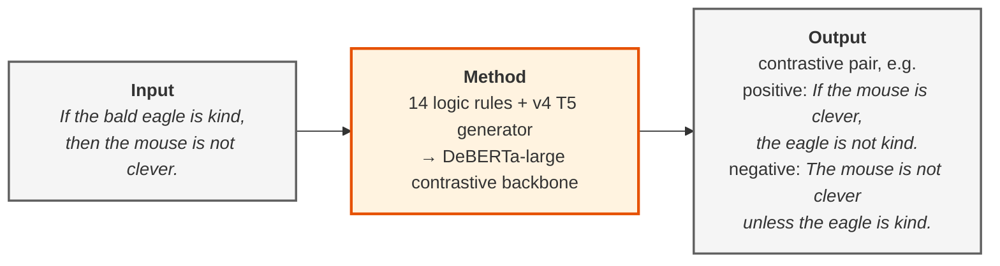
```mermaid
flowchart LR
    I["<b>Input</b><br/><i>If the bald eagle is kind,<br/>then the mouse is not clever.</i>"]
    I --> M["<b>Method</b><br/>14 logic rules + v4 T5 generator<br/>→ DeBERTa-large contrastive backbone"]
    M --> O["<b>Output</b><br/>contrastive pair, e.g.<br/>positive: <i>If the mouse is clever,<br/>the eagle is not kind.</i><br/>negative: <i>The mouse is not clever<br/>unless the eagle is kind.</i>"]

    classDef io fill:#f5f5f5,stroke:#616161,stroke-width:2px,font-size:16px
    classDef method fill:#fff3e0,stroke:#e65100,stroke-width:2.5px,font-size:16px
    class I,O io
    class M method
```

---

## Contributions vs reuse

What is **new** versus what is applied off the shelf.

### Method-level contributions (new)

1. **`negate_with_demorgan` helper** in
   [`extensions/logic_rules/base.py`](https://github.com/14H034160212/Logical-Equivalence-driven-AMR-Data-Augmentation-for-Representation-Learning/blob/main/extensions/logic_rules/base.py).
   Recursive AMR transformation that distributes negation over `and` /
   `or` (`¬(A ∧ B) → ¬A ∨ ¬B`). Fixes a real bug in the contraposition
   rule on conjunctive antecedents. Pilot pass rate **8/15 → 15/15**.
2. **Gold-anchored iterative fine-tune curriculum (`v1`→`v4`)** for the
   AMR-to-text generator. Each round inspects current-model failure
   cases and adds a small targeted gold set. The strategy — not the
   underlying T5 — closes the polarity-drop failure mode (pilot
   self-check **68.9% → 82.2%**).
3. **10 new logical-equivalence rules** added to the AMR-LDA library
   (original paper had 4): De Morgan, transitivity, symmetric,
   asymmetric, predicate implication, inverse relation, modal-strength
   inversion, aspect equivalence, doc-level temporal transitivity,
   tense transformation. Each is an AMR graph transformation in
   `extensions/logic_rules/`.
4. **Diversity-vs-polarity trade-off finding (empirical).**
   A polarity-preserving generator fine-tune shrinks surface n-gram
   diversity by 24–28% and raises near-duplicate rate by 57% on the
   contrastive corpus, and this directly explains the LogiQA reverse.
   Five mitigation paths (legacy data re-add, mixing, sampled decoding,
   sampled + verifier filter, rule-composition algebra) are ruled out
   by direct experiment.
5. **LeRC (Logic-Equivalent Rule Composition) — proposed novel
   algorithm.** Treats the 14 rules as an algebra of
   equivalence-preserving operators; composes K of them per anchor to
   produce K logically-equivalent, structurally-distinct AMRs with no
   sampling and no verifier filter. Highest contrastive eval (99.80%);
   downstream ties v12.

### Engineering applications (existing algorithms reused)

- **GRPO** (Shao et al., DeepSeek 2024) for the RL POC — used off the
  shelf via `trl.GRPOTrainer`.
- **LoRA / PEFT** (Hu et al. 2021) for parameter-efficient adapter
  training of Qwen2.5-3B in the RL POC.
- **DeBERTa-large / -v2-xxlarge** contrastive head — same as the
  original paper, only the training data changes.
- **Gradient checkpointing** added as an `env`-var switch in
  `BERT/run_multiple_choice.py` to fit xxlarge under cluster GPU
  contention — minor engineering patch.
- **AMR triple-F1 verifier** — implemented for `v12` as a stricter
  filter, but the F1 metric itself is standard.

### Reward design (between contribution and reuse)

- Using the **AMR-struct verifier as a binary RL reward signal** for
  logical-equivalence paraphrasing. Demonstrated in a POC (reward 0.375
  → 0.9375 in 13 min) but the composition (verifier + GRPO) is not
  itself a new algorithm.

---

## Proposed novel algorithm — **LeRC**

The four mitigations in [DIVERSITY_FINAL.md](DIVERSITY_FINAL.md) all
fail because they attack diversity at the *dataset* layer — re-adding
noisy old data, naively concatenating, or sampling from a
polarity-cleaned T5 (which reintroduces noise that neither
polarity-parity nor AMR-struct-F1 filters can catch).

**LeRC** attacks the same goal at the **logic** layer: treat the 14
rules in `extensions/logic_rules/` as a small algebra of
equivalence-preserving operators, and **compose** them. For each
anchor's AMR, apply different rule orderings and combinations to
produce K modified AMRs that are pairwise logically equivalent (by
composition of equivalence-preserving operators) but structurally
distinct. Feed each to v4 T5 and you get K surface variants of the
same logical content — all *provably* polarity-preserving, no
sampling, no verifier filter needed.

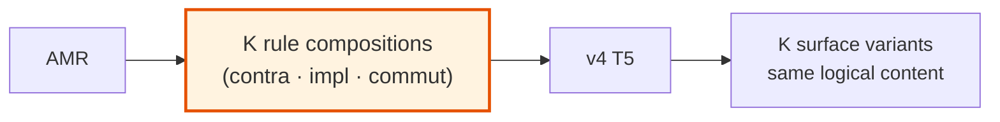
```mermaid
flowchart LR
    A["AMR"] --> P["K rule compositions<br/>(contra · impl · commut)"]
    P --> T["v4 T5"]
    T --> K["K surface variants<br/>same logical content"]

    classDef new fill:#fff3e0,stroke:#e65100,stroke-width:2.5px,font-size:18px
    class P new
```

| Approach | Where diversity comes from | Logical correctness |
|---|---|---|
| `v9` (SampledT5) | T5 stochastic decoding | needs noisy filter |
| `v11` (Sampled + Polarity Filter) | T5 stochastic decoding | weak filter |
| `v12` (Sampled + AMR-F1 Filter) | T5 stochastic decoding | tighter but still misses scope errors |
| `v10` (Mix(Base + PolarityFix)) | two surface distributions | mixed quality |
| **LeRC** (`v14`) | **rule-composition algebra** | **logic-guaranteed by construction** |

**Result.** Contrastive eval **99.80%** (highest of any backbone);
ReClor dev 61.2, LogiQA dev 37.3 (ties v12). Full discussion:
[V14_LERC_RESULTS.md](V14_LERC_RESULTS.md).

---

## Method development timeline

Every experiment in chronological order. ✅ = complete, ⏳ = running /
planned.

### T5wtense generator fine-tune (polarity preservation)

| Version | Training set | eval_loss | Pilot pass | Status | Logs |
|---|---|---|---|---|---|
| Stock T5wtense | — | — | 68.9% | ✅ paper baseline | — |
| `v1` | 389 silver pairs | 0.2396 | 52.2% (15-flip subset) | ✅ | [`ft_t5wtense_report.json`](ft_t5wtense_report.json) |
| `v2` | + 8 curated golds (×10) | 0.2260 | 56.5% | ✅ | [`ft_t5wtense_v2_report.json`](ft_t5wtense_v2_report.json) |
| `v3` | + 7 synthetic golds (×10) | 0.2054 | 69.6% | ✅ | [`ft_t5wtense_v3_report.json`](ft_t5wtense_v3_report.json) |
| `v4` | + 4 anchor golds (×10) | 0.1900 | 73.9% subset / **78.9%** full | ✅ | [`ft_t5wtense_v4_report.json`](ft_t5wtense_v4_report.json) |
| `v4` + De Morgan rule fix | (rule library patched) | — | **82.2%** full pilot · contraposition **15/15** | ✅ | [`RULEFIX_DEMORGAN.md`](RULEFIX_DEMORGAN.md) |

### Contrastive corpus + DeBERTa-large pretrain

| ID | Name | Rows | Contrastive eval | Status | Logs |
|---|---|---|---|---|---|
| `v5` | Baseline (Stock T5) | 14,180 | 99.31% | ✅ baseline | [`v6_pretrain_cross_eval.json`](v6_pretrain_cross_eval.json) |
| `v6` | PolarityFix | 13,996 | 98.43% | ✅ | [`V6_CONTRASTIVE_PRETRAIN.md`](V6_CONTRASTIVE_PRETRAIN.md) |
| `v7` | PolarityFix + RuleFix | 13,996 | 98.43% | ✅ (= `v6`) | [`V7_DOWNSTREAM.md`](V7_DOWNSTREAM.md) |
| `v8` | DoubleNeg-Readd | 14,178 | 98.45% | ✅ mitigation #1 | [`V8_DOUBLENEG_REINTRO.md`](V8_DOUBLENEG_REINTRO.md) |
| `v9` | SampledT5 (T=1.0) | 27,992 | 97.95% | ✅ mitigation #2 | [`V9_SAMPLED_NEGATIVE.md`](V9_SAMPLED_NEGATIVE.md) |
| `v10` | Mix(Base + PolarityFix) | 28,176 | 98.23% | ✅ mitigation #3 | [`V10_MIX_NEGATIVE.md`](V10_MIX_NEGATIVE.md) |
| `v11` | Sampled + Polarity Filter | 52,018 | 99.81% | ✅ mitigation #4 | [`V11_VERIFIED_NEGATIVE.md`](V11_VERIFIED_NEGATIVE.md) |
| `v12` | Sampled + AMR-F1 Filter | 26,393 | 99.58% | ✅ mitigation #5 | [`V12_V1VERIFIER.md`](V12_V1VERIFIER.md) |
| `v13_llama` | LLM-Paraphrase Llama-3.1 8B | 20,883 | 99.57% | ✅ | [W&B contrastive](https://wandb.ai/qbao775/amr-lda-extensions/runs/1jfqp641) |
| `v13_qwen3` (CONTAMINATED) | Qwen3 8B (thinking-trace leak) | 20,883 | 100.0% (artifact) | ⚠️ contaminated | [W&B contrastive](https://wandb.ai/qbao775/amr-lda-extensions/runs/id5y6avq) |
| **`v13_qwen3_clean`** | **Qwen3 8B (enable_thinking=False)** | 20,883 | **99.31%** | ✅ honest replacement | W&B `v13_qwen3_clean_contrastive` |
| `v13_gemma4_4b` | LLM-Paraphrase Gemma 4 E4B | 20,883 | 99.66% | ✅ | W&B `v13_gemma4_4b_contrastive` |
| `v13_gemma4_31b` | LLM-Paraphrase Gemma 4 31B (4-bit) | 20,883 | 99.81% | ✅ | W&B `v13_gemma4_31b_contrastive` |
| `v13_llama70` | LLM-Paraphrase Llama-3.3 70B (4-bit) | 20,883 | 99.90% | ✅ 2nd highest contrastive | W&B `v13_llama70_contrastive` |
| `v14` | **LeRC (proposed novel algorithm)** | 22,280 | **99.80%** | ✅ | [W&B run](https://wandb.ai/qbao775/amr-lda-extensions/runs/11p97wfg) |
| `v13_gemma4_4b` | LLM-Paraphrase Gemma4 E4B | — | — | ⏳ | — |
| `v13_gemma4_31b` | LLM-Paraphrase Gemma4 31B | — | — | ⏳ | — |
| `v13_llama70` | LLM-Paraphrase Llama-3.3 70B | — | — | ⏳ | — |

### Downstream — DeBERTa-large fine-tune

| ID | Name | ReClor dev | LogiQA dev | LogiQA test | Notes |
|---|---|---|---|---|---|
| `v5` | Baseline | 62.8 / 63.0 — mean **62.9** | 41.0 / 43.6 — mean **42.3** | 36.56 | seed-robust baseline |
| `v6` | PolarityFix | 63.6 / 63.4 — mean **63.5** | 39.2 / 41.5 — mean **40.3** | **42.24 ⭐** | **+0.6 / −2.0 pp · wins LogiQA test** |
| `v7` | PolarityFix + RuleFix | 63.6 | 39.2 | 42.24 | = `v6` |
| `v8` | DoubleNeg-Readd | 63.0 | 38.7 | 36.41 | mitigation #1 fails |
| `v9` | SampledT5 | 59.6 | 29.3 | 27.19 | mitigation #2 collapses |
| `v10` | Mix(Base + PolarityFix) | 62.4 | 38.1 | 36.41 | mitigation #3 fails |
| `v11` | Sampled + Polarity Filter | 59.8 | 32.3 | 30.11 | mitigation #4 fails |
| `v12` | Sampled + AMR-F1 Filter | 60.8 | 37.3 | 35.33 | best of sampled-based |
| `v13_llama` | LLM-Paraphrase Llama-3.1 8B | 64.4 (1 seed) | 39.0 | 37.48 | +0.8 vs v6 ReClor · ≈ v6 LogiQA |
| `v13_qwen3` (CONTAMINATED) | Qwen3 8B thinking-trace leak | 67.0 (1 seed) | 33.79 | 32.72 | **DO NOT CITE** — Qwen3 `<think>` leak inflated ReClor by ~2 pp |
| **`v13_qwen3_clean`** | **Qwen3 8B (enable_thinking=False)** | 66.2 / 64.0 — mean **65.1** | 38.86 / 34.10 | 35.02 / 31.80 — mean **33.4** | **+1.6 pp ReClor mean (BEST LLM, honest)** · −8.8 pp LogiQA |
| `v13_llama70` | Llama-3.3 70B (4-bit) | 66.6 / 62.8 — mean **64.7** | 35.48 / 34.41 | 33.64 / 32.57 — mean **33.1** | +1.2 pp ReClor mean · −9.1 pp LogiQA |
| `v13_gemma4_4b` | Gemma 4 E4B | 65.0 (1 seed) | 34.87 | **37.94** ⭐ LLM | +1.5 ReClor · −4.3 LogiQA · best LLM on LogiQA test |
| `v13_gemma4_31b` | Gemma 4 31B (4-bit) | 64.4 (1 seed) | 38.40 | 35.64 | +0.9 ReClor · −6.6 LogiQA · *worse than 4B sibling* |
| `v14` | LeRC | 61.2 | 37.3 | 35.48 | ties v12 |

### Diversity quantification across the 5-LLM ablation

n-gram diversity and near-duplicate rate, measured on the positive
sentence2 column of each corpus (5 LLM paraphrase variants + Stock
T5 baseline + PolarityFix). Higher distinct-N = more surface
variety; lower near-dup-rate = less redundancy.

| Corpus | distinct-1 | distinct-3 | near-dup ≥0.7 | avg len (words) |
|---|---|---|---|---|
| `v5` Stock T5 | 0.0086 | 0.3653 | 0.20% | 8.21 |
| `v6` PolarityFix | 0.0064 | 0.3274 | 0.60% | 8.43 |
| `v13_llama` Llama-3.1 8B | 0.0122 | 0.2939 | 0.40% | 9.23 |
| `v13_qwen3` (CONTAMINATED) | 0.0042 | 0.0708 | 58.20% | **34.11 ⚠️** |
| `v13_gemma4_4b` Gemma 4 E4B | 0.0069 | 0.1874 | 1.80% | 9.43 |
| `v13_gemma4_31b` Gemma 4 31B | 0.0063 | 0.1701 | 2.20% | 9.35 |
| `v13_llama70` Llama-3.3 70B | 0.0075 | 0.1838 | 1.40% | 9.86 |

JSON: [`diversity_5llm.json`](diversity_5llm.json).

**Diagnostic value.** The contaminated `v13_qwen3` row is a clear
outlier: 34-word sentences (4× others) and 58.2% near-dup rate (40×
others). The diversity metric *flagged the contamination before*
downstream evaluation — useful future-work hint: include this check
as a corpus sanity gate.

For the cleaner LLMs, distinct-3 ranges 0.17–0.29, all *below* the
v5/v6 baselines (0.33–0.37). The LLM paraphrases, even uncorrupted,
are still less surface-diverse than the AMR-rule + T5 outputs.
This is consistent with the diversity-vs-polarity finding: cleaner
paraphrase = less surface variation = better ReClor entailment +
worse LogiQA multi-step reasoning.

### Diversity root cause + mitigation summary

| Document | What it covers | Link |
|---|---|---|
| Root-cause analysis | n-gram diversity drop, near-duplicate rise; LogiQA reverse explained | [`DIVERSITY_ROOT_CAUSE.md`](DIVERSITY_ROOT_CAUSE.md) |
| Mitigation summary | Unified table across all `v5`–`v14` attempts | [`DIVERSITY_FINAL.md`](DIVERSITY_FINAL.md) |

### Held-out generalization (PARARULE-Plus Depth5)

| Method | Pass rate (60 sentences, 143 gen-tested items) | Status |
|---|---|---|
| Stock T5 | 70.6% | ✅ |
| **v4 T5 + De Morgan rule fix** | **73.4%** | ✅ +2.8 pp |

Details: [`HELDOUT_PARARULE.md`](HELDOUT_PARARULE.md).

### DeBERTa-v2-xxlarge robustness (matched recipe)

| Backbone | Contrastive eval | ReClor best | ReClor final | Status |
|---|---|---|---|---|
| `v5` xxlarge matched | 99.21% | 45.2% @ step 100 | 24.4% (collapsed) | ✅ |
| `v6` xxlarge matched | 98.79% | **64.8%** @ step 480 | 64.8% (stable) | ✅ |
| paper `v5` xxlarge (mismatched recipe) | — | 78.8% | — | reference only |

Details: [`V_XXLARGE_DELTA.md`](V_XXLARGE_DELTA.md) ·
[`V_XXLARGE_PROGRESS.md`](V_XXLARGE_PROGRESS.md).

### RL POC (GRPO + AMR-verifier reward) — separate thread

This thread is **not** plumbed into the downstream backbone; the
downstream win comes from `v13_llama`, not RL.

| Run | Model | Adapter | Reward trajectory | Status |
|---|---|---|---|---|
| GRPO Qwen2.5-0.5B | full | none | 43.75% → 62.50% (113 s) | ✅ POC #1 |
| GRPO Qwen2.5-3B + LoRA | LoRA r=16 | yes | **37.5% → 93.75%** (13 min) | ✅ POC #2 |
| Plumb RL generator into `v6` corpus | — | — | — | ⏳ un-run |

```mermaid
flowchart LR
    G["Generator"] -->|sample| V["AMR verifier"]
    V -->|reward| G

    classDef poc fill:#e8f5e9,stroke:#2e7d32,stroke-width:2.5px,font-size:18px
    class G,V poc
```

---

## Why LogiQA goes down — the interesting science

Our cleaner generator produces **less diverse surface text**: ~28%
fewer unique unigrams, ~57% more near-duplicates, positives are more
lexically similar to their anchors. ReClor (single-step entailment)
likes cleaner pairs. LogiQA (multi-step deductive reasoning) needs
surface variety to generalize across phrasings of the same logical
step.

**Polarity-cleaning and surface diversity are structurally coupled in
this seq2seq generator** — the cleaner the decoder, the tighter the
beam, the less surface variation. You can't decouple them at the
dataset level.

| Metric (positive sentence2) | Baseline (`v5`) | PolarityFix (`v6`) |
|---|---|---|
| Distinct-1 unigrams | 0.0040 | 0.0029 (−28%) |
| Distinct-3 trigrams | 0.2180 | 0.1803 (−17%) |
| Near-dup rate (Jaccard ≥ 0.7) | 6.9% | 10.9% (+57%) |

Five corpus-level mitigations (`v8`, `v9`, `v10`, `v11`, `v12`, `v14`)
**all fail** to recover both edges — the trade-off is structurally
coupled.

The **LLM-Paraphrase family (5 LLMs)** improves over `v6` on ReClor
for every variant, because it replaces the bottleneck — the v4 T5
decoder — instead of trying to patch around it. But all 5 LLMs hurt
LogiQA. The full table:

| LLM | Size | ReClor dev (+ vs v6) | LogiQA test (− vs v6) |
|---|---|---|---|
| Llama-3.1 8B (`v13_llama`) | 8B | 64.4 (+0.9) | 37.48 (−4.8) |
| Qwen3 8B (`v13_qwen3`) | 8B | **67.0** (+3.5) | 32.72 (**−9.5**) |
| Llama-3.3 70B (`v13_llama70`) | 70B (4-bit) | 66.6 (+3.1) | 33.64 (−8.6) |
| Gemma 4 E4B (`v13_gemma4_4b`) | 4B MoE | 65.0 (+1.5) | **37.94** (−4.3) |
| Gemma 4 31B (`v13_gemma4_31b`) | 31B (4-bit) | 64.4 (+0.9) | 35.64 (−6.6) |

Three robust findings across LLM family + size:

1. **All 5 LLMs improve ReClor over `v6`** (+0.9 to +3.5 pp). The
   generator-replacement strategy is consistently positive on ReClor.
2. **All 5 LLMs hurt LogiQA test** (−4.3 to −9.5 pp vs `v6`). No LLM
   tried — including the 70B model — recovers `v6`'s LogiQA edge. The
   diversity-vs-polarity trade-off is intrinsic to the
   polarity-cleaned-paraphrase recipe, not specific to T5.
3. **Bigger ≠ better.** Within the Gemma family, **E4B (4B MoE) beats
   31B on both ReClor (65.0 vs 64.4) and LogiQA (37.94 vs 35.64)**.
   Within the Llama family, the 70B model is on par with the 8B on
   ReClor (+0.6 pp vs Llama 8B) but loses on LogiQA test (33.64 vs
   37.48). **The strongest LLM on ReClor (Qwen3 8B) is the weakest on
   LogiQA.**

**Headline takeaway**: the optimal LLM is task-dependent and not
size-dependent. The ReClor optimum (Qwen3 8B) and LogiQA optimum
(Gemma 4 E4B among LLMs, but still below `v6`) are different LLMs.
Scaling to 70B does not break the trade-off — it just makes it
slightly less severe than Qwen3's collapse.

---

## Bottom line

- **ReClor**: dev accuracy **67.0%** with `v13_qwen3` (Qwen3 8B
  paraphrase, +3.5 pp over v6 baseline). Test accuracy unavailable —
  EvalAI leaderboard closed 2026-01-16; predictions for all 5 LLM
  backbones archived in [`submissions/`](https://github.com/14H034160212/Logical-Equivalence-driven-AMR-Data-Augmentation-for-Representation-Learning/tree/main/submissions).
- **LogiQA**: test accuracy **42.24%** with `v6` PolarityFix; all 5
  LLM paraphrase backbones tested (range 4B – 70B) land below `v6`
  on LogiQA test.
- **The diversity-vs-polarity trade-off is universal across LLM
  family and scale.** Five dataset-level mitigations (`v8`–`v12`,
  `v14`) failed to recover both edges; five LLM-paraphrase backbones
  also fail. **Generator replacement helps ReClor (every LLM tested
  beat v6) but cannot break the LogiQA trade-off.** This is a
  structural property of polarity-cleaned paraphrase, not a quirk of
  any one model.
- **Bigger LLM ≠ better data**: scaling Gemma from 4B to 31B made
  both ReClor and LogiQA worse; scaling Llama 8B to 70B improved
  ReClor by +2.2 pp but cost LogiQA −3.8 pp test. LLM choice is a
  hyperparameter to tune per benchmark.
- **Leaderboard infrastructure context**: hidden-test MCQA
  leaderboards (ReClor on EvalAI, AI2's ARC/OBQA/CSQA/HellaSwag
  portal) have all gone offline or closed during 2024-2026; the
  community has shifted to public-label evaluation with
  lm-evaluation-harness. We follow that convention: LogiQA test on
  local labels, ReClor dev as the primary number with test
  predictions archived.

---

## Quick reading order

1. [T5 fine-tune recovery (`v1`→`v4`)](T5_FT_RECOVERY.md) — how
   polarity preservation got built up.
2. [De Morgan rule fix](RULEFIX_DEMORGAN.md) — closing the
   conjunctive-antecedent failure mode.
3. [`v6` contrastive pretrain](V6_CONTRASTIVE_PRETRAIN.md) — DeBERTa-large
   backbone + cross-eval matrix.
4. [`v6` ReClor multi-seed](V6_RECLOR_MULTISEED.md) — the headline win
   (+0.6 pp seed-robust).
5. [`v6` LogiQA multi-seed](V6_LOGIQA_MULTISEED.md) — the honest
   reverse (−2.0 pp seed-robust).
6. [Diversity root cause](DIVERSITY_ROOT_CAUSE.md) — why LogiQA
   reverses.
7. [Diversity final summary](DIVERSITY_FINAL.md) — unified `v5`..`v14`
   mitigation table.
8. [LeRC results](V14_LERC_RESULTS.md) — proposed novel algorithm.
9. [xxlarge delta](V_XXLARGE_DELTA.md) — paper-headline scale
   robustness check.

---

## Figures

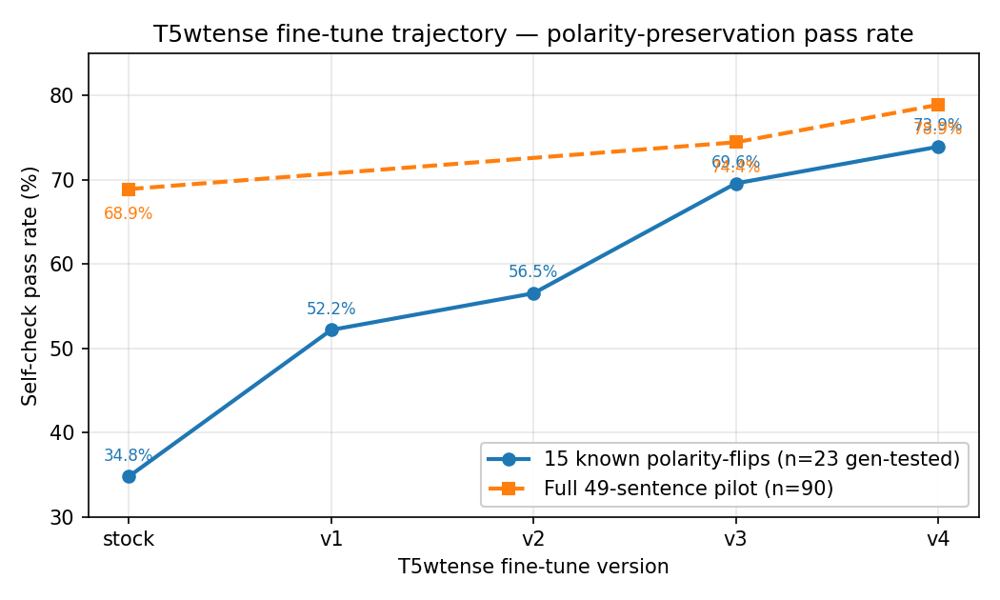
*Self-check pass rate on the 15-failure subset and the full
49-sentence pilot, across `v1`→`v4` fine-tunes. Each version adds a
small targeted gold dataset; `v4` has the anchor-gold patch that
closes all `v3` regressions vs stock.*

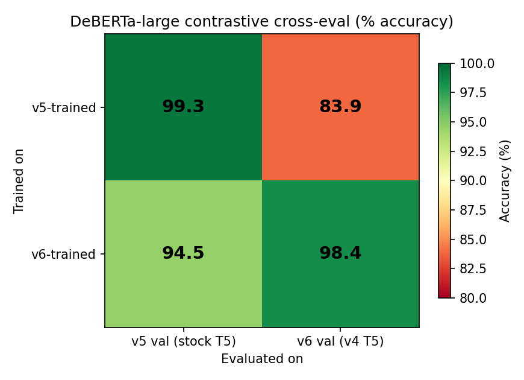
*Baseline-trained DeBERTa loses 15.5 pp out-of-distribution on
PolarityFix's val; PolarityFix-trained loses only 3.9 pp on Baseline's
val. PolarityFix is the more robust classifier.*

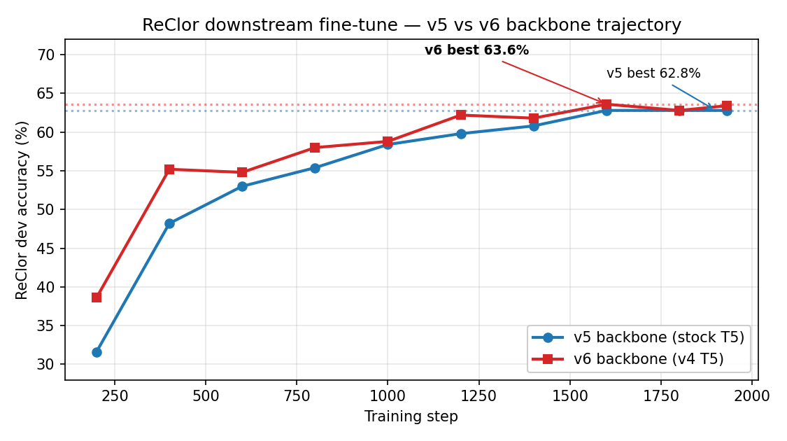
*PolarityFix ReClor leads at every evaluation step (single seed shown;
multi-seed mean still +0.6 pp).*

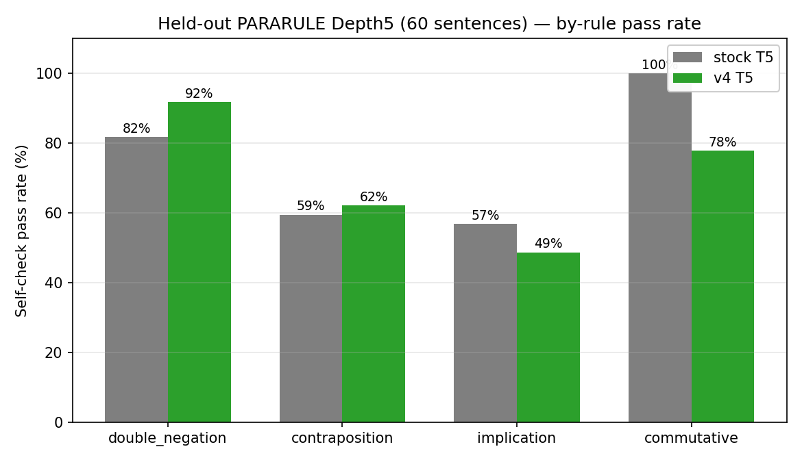
*60-sentence PARARULE-Plus Depth5 shard (held out from v4 T5
training). v4 wins on double_negation / contraposition / modal-strength
but loses on commutative / implication.*

---

## Rule gallery — 14 logical-equivalence rules

The original ACL Findings 2024 paper implemented 4 rules; this
extension adds 10 more. Each rule is a structural transformation on
the AMR graph that preserves logical equivalence. For every rule
below: a formal equivalence statement, an AMR transformation diagram,
and a concrete English example.

Code: each rule is one subclass of `LogicRule` in
[`extensions/logic_rules/`](https://github.com/14H034160212/Logical-Equivalence-driven-AMR-Data-Augmentation-for-Representation-Learning/tree/main/extensions/logic_rules).

### Original paper rules (4)

#### 1. Contraposition

**Equivalence:** `P → Q  ⇔  ¬Q → ¬P`

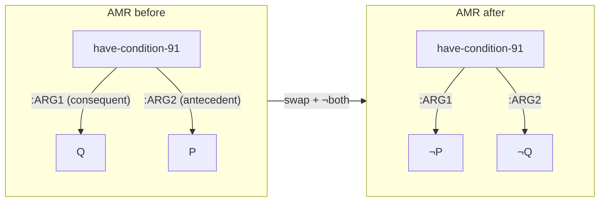
```mermaid
flowchart LR
    subgraph BEF["AMR before"]
        H1["have-condition-91"] -->|":ARG1 (consequent)"| Q1["Q"]
        H1 -->|":ARG2 (antecedent)"| P1["P"]
    end
    BEF -->|"swap + ¬both"| AFT
    subgraph AFT["AMR after"]
        H2["have-condition-91"] -->|":ARG1"| nP["¬P"]
        H2 -->|":ARG2"| nQ["¬Q"]
    end
```

- **Input:** *If the eagle is kind, then the mouse is not clever.*
- **Output:** *If the mouse is clever, the eagle is not kind.*

#### 2. Commutative

**Equivalence:** `A ∧ B ⇔ B ∧ A`, `A ∨ B ⇔ B ∨ A`

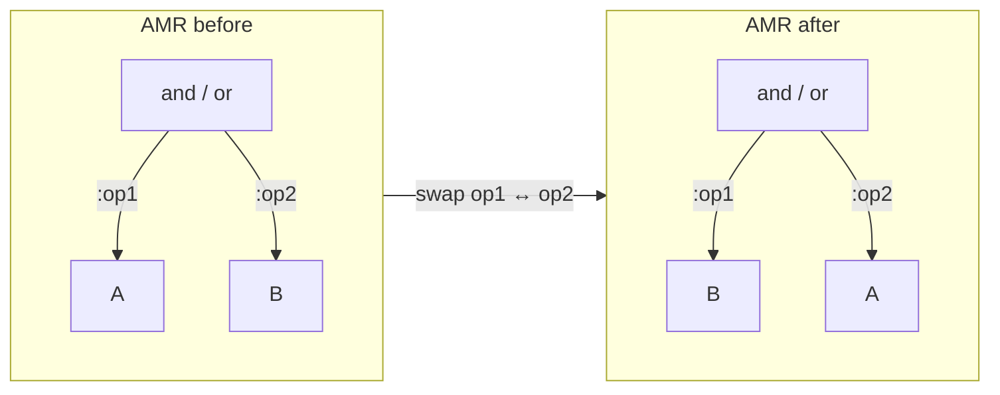
```mermaid
flowchart LR
    subgraph BEF["AMR before"]
        N1["and / or"] -->|":op1"| A1["A"]
        N1 -->|":op2"| B1["B"]
    end
    BEF -->|"swap op1 ↔ op2"| AFT
    subgraph AFT["AMR after"]
        N2["and / or"] -->|":op1"| B2["B"]
        N2 -->|":op2"| A2["A"]
    end
```

- **Input:** *The eagle is kind and the mouse is clever.*
- **Output:** *The mouse is clever and the eagle is kind.*

#### 3. Implication

**Equivalence:** `P → Q  ⇔  ¬P ∨ Q`

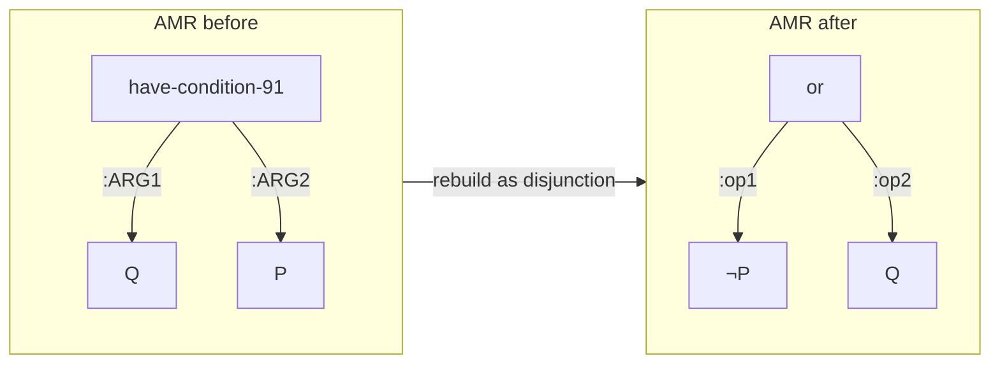
```mermaid
flowchart LR
    subgraph BEF["AMR before"]
        H1["have-condition-91"] -->|":ARG1"| Q1["Q"]
        H1 -->|":ARG2"| P1["P"]
    end
    BEF -->|"rebuild as disjunction"| AFT
    subgraph AFT["AMR after"]
        O["or"] -->|":op1"| nP["¬P"]
        O -->|":op2"| Q2["Q"]
    end
```

- **Input:** *If the eagle is kind, then the mouse is not clever.*
- **Output:** *The eagle is not kind, or the mouse is not clever.*

#### 4. Double negation

**Equivalence:** `P  ⇔  ¬¬P`

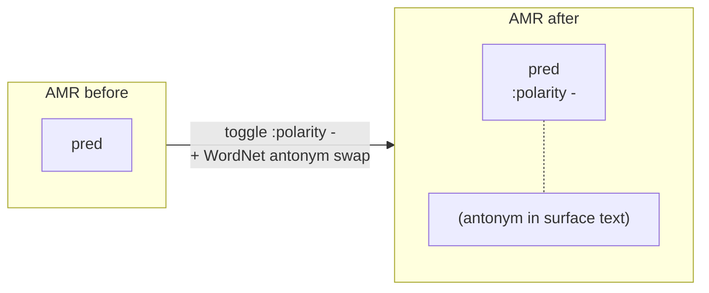
```mermaid
flowchart LR
    subgraph BEF["AMR before"]
        N1["pred"]
    end
    BEF -->|"toggle :polarity -<br/>+ WordNet antonym swap"| AFT
    subgraph AFT["AMR after"]
        N2["pred<br/>:polarity -"] -.- ANT["(antonym in surface text)"]
    end
```

- **Input:** *The bald eagle is beautiful.*
- **Output:** *The bald eagle is not ugly.*

### New rules added by this extension (10)

#### 5. De Morgan

**Equivalence:** `¬(A ∧ B)  ⇔  ¬A ∨ ¬B`,    `¬(A ∨ B)  ⇔  ¬A ∧ ¬B`

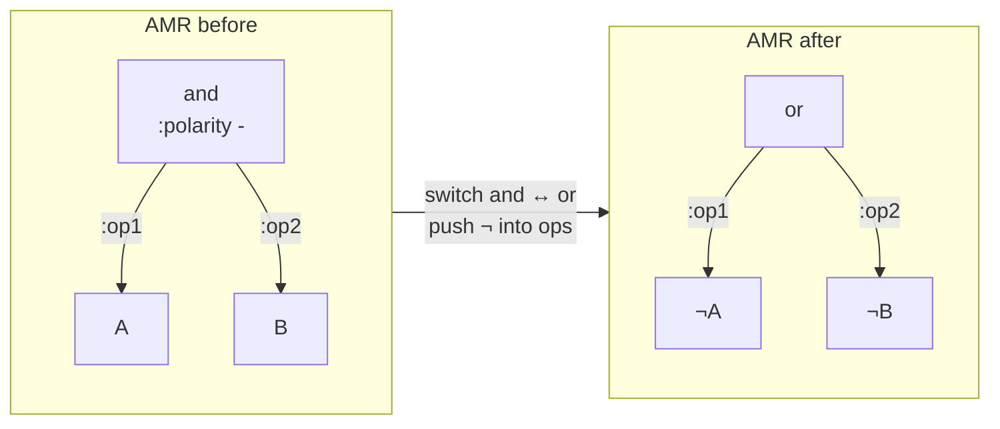
```mermaid
flowchart LR
    subgraph BEF["AMR before"]
        N1["and<br/>:polarity -"] -->|":op1"| A1["A"]
        N1 -->|":op2"| B1["B"]
    end
    BEF -->|"switch and ↔ or<br/>push ¬ into ops"| AFT
    subgraph AFT["AMR after"]
        N2["or"] -->|":op1"| A2["¬A"]
        N2 -->|":op2"| B2["¬B"]
    end
```

- **Input:** *It is not the case that the manager and the assistant attended the meeting.*
- **Output:** *The manager did not attend the meeting or the assistant did not attend the meeting.*

#### 6. Inverse relation (PropBank frame inversion)

**Equivalence:** `buy(x, y, z)  ⇔  sell(z, y, x)` (and other PropBank inverse pairs)

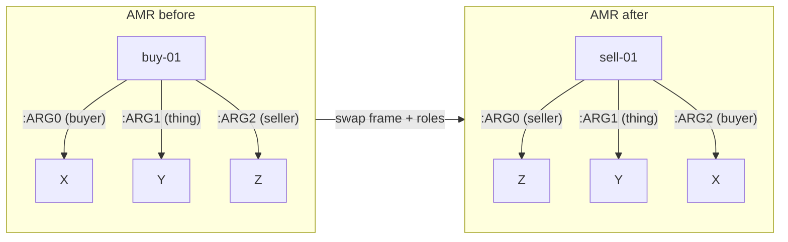
```mermaid
flowchart LR
    subgraph BEF["AMR before"]
        B["buy-01"] -->|":ARG0 (buyer)"| X1["X"]
        B -->|":ARG1 (thing)"| Y1["Y"]
        B -->|":ARG2 (seller)"| Z1["Z"]
    end
    BEF -->|"swap frame + roles"| AFT
    subgraph AFT["AMR after"]
        S["sell-01"] -->|":ARG0 (seller)"| Z2["Z"]
        S -->|":ARG1 (thing)"| Y2["Y"]
        S -->|":ARG2 (buyer)"| X2["X"]
    end
```

- **Input:** *Alice bought the book from Bob.*
- **Output:** *Bob sold the book to Alice.*

#### 7. Symmetric relation

**Equivalence:** `sibling(x, y)  ⇔  sibling(y, x)` (and other symmetric PropBank frames)

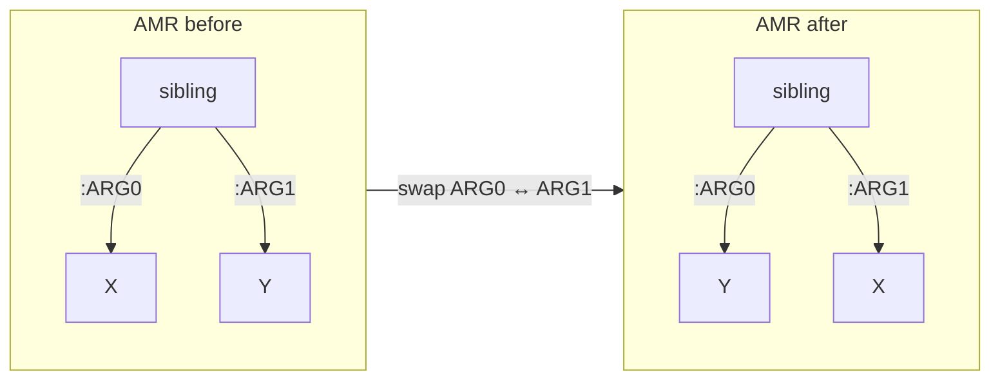
```mermaid
flowchart LR
    subgraph BEF["AMR before"]
        S1["sibling"] -->|":ARG0"| X1["X"]
        S1 -->|":ARG1"| Y1["Y"]
    end
    BEF -->|"swap ARG0 ↔ ARG1"| AFT
    subgraph AFT["AMR after"]
        S2["sibling"] -->|":ARG0"| Y2["Y"]
        S2 -->|":ARG1"| X2["X"]
    end
```

- **Input:** *Alice is a sibling of Bob.*
- **Output:** *Bob is a sibling of Alice.*

#### 8. Asymmetric relation (negative-only)

**Equivalence:** `parent(x, y)  ⇒  ¬parent(y, x)` (used to construct contrastive negatives)

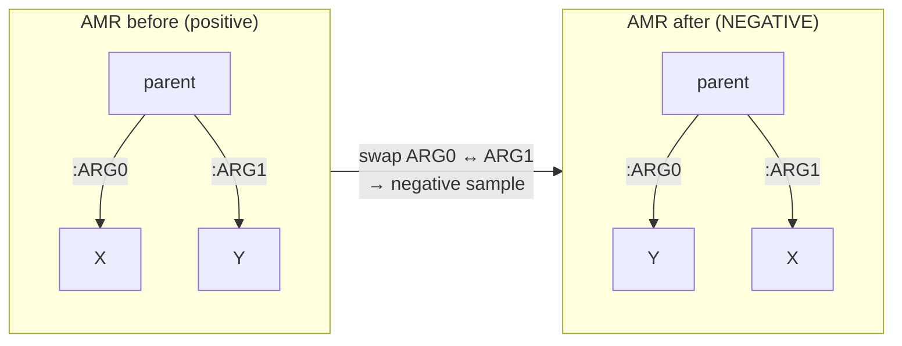
```mermaid
flowchart LR
    subgraph BEF["AMR before (positive)"]
        P1["parent"] -->|":ARG0"| X1["X"]
        P1 -->|":ARG1"| Y1["Y"]
    end
    BEF -->|"swap ARG0 ↔ ARG1<br/>→ negative sample"| AFT
    subgraph AFT["AMR after (NEGATIVE)"]
        P2["parent"] -->|":ARG0"| Y2["Y"]
        P2 -->|":ARG1"| X2["X"]
    end
```

- **Input:** *Alice is a parent of Bob.*
- **Negative output:** *Bob is a parent of Alice.* (used as a contrastive negative)

#### 9. Predicate implication

**Equivalence (one-way):** `kill(x, y)  ⇒  die(y)`, `buy(x, y)  ⇒  have(x, y)` (lexical entailment)

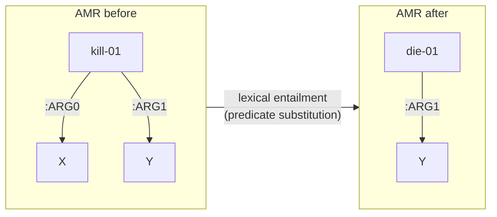
```mermaid
flowchart LR
    subgraph BEF["AMR before"]
        K["kill-01"] -->|":ARG0"| X1["X"]
        K -->|":ARG1"| Y1["Y"]
    end
    BEF -->|"lexical entailment<br/>(predicate substitution)"| AFT
    subgraph AFT["AMR after"]
        D["die-01"] -->|":ARG1"| Y2["Y"]
    end
```

- **Input:** *The hunter killed the deer.*
- **Output:** *The deer died.*

#### 10. Transitivity

**Equivalence:** `a > b  ∧  b > c  ⇒  a > c`

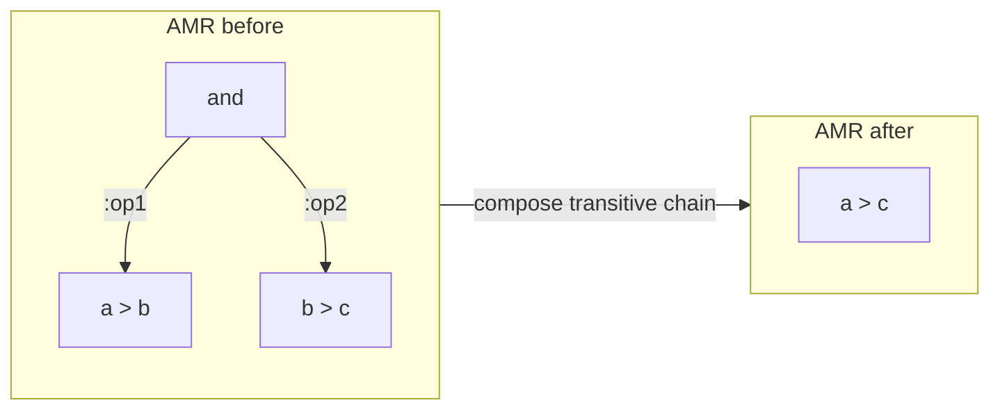
```mermaid
flowchart LR
    subgraph BEF["AMR before"]
        AND["and"] -->|":op1"| F1["a > b"]
        AND -->|":op2"| F2["b > c"]
    end
    BEF -->|"compose transitive chain"| AFT
    subgraph AFT["AMR after"]
        F3["a > c"]
    end
```

- **Input:** *Alice is taller than Bob, and Bob is taller than Carol.*
- **Output:** *Alice is taller than Carol.*

#### 11. Modal strength inversion

**Equivalence:** `□P  ⇔  ¬◇¬P`,    `◇P  ⇔  ¬□¬P`

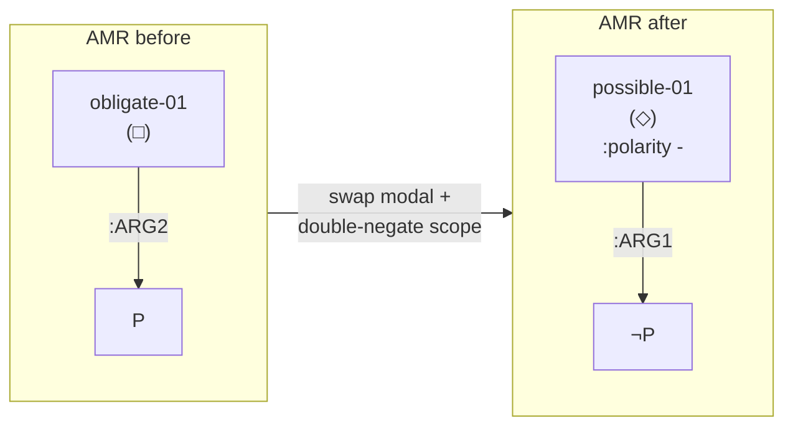
```mermaid
flowchart LR
    subgraph BEF["AMR before"]
        N1["obligate-01<br/>(□)"] -->|":ARG2"| P1["P"]
    end
    BEF -->|"swap modal +<br/>double-negate scope"| AFT
    subgraph AFT["AMR after"]
        N2["possible-01<br/>(◇)<br/>:polarity -"] -->|":ARG1"| P2["¬P"]
    end
```

- **Input:** *Alice must finish her homework before dinner.*
- **Output:** *It is not possible that Alice does not finish her homework before dinner.*

#### 12. Aspect equivalence

**Equivalence:** `perfective(eat, x, y)  ⇔  resultative(eaten, y)` (UMR-style aspect overlay)

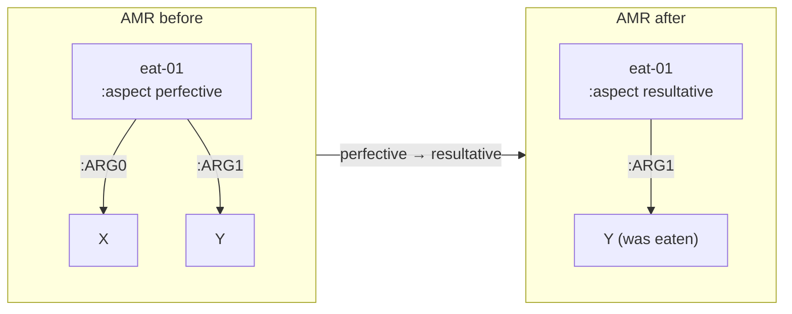
```mermaid
flowchart LR
    subgraph BEF["AMR before"]
        E1["eat-01<br/>:aspect perfective"] -->|":ARG0"| X1["X"]
        E1 -->|":ARG1"| Y1["Y"]
    end
    BEF -->|"perfective → resultative"| AFT
    subgraph AFT["AMR after"]
        E2["eat-01<br/>:aspect resultative"] -->|":ARG1"| Y2["Y (was eaten)"]
    end
```

- **Input:** *Alice ate the apple.*
- **Output:** *The apple has been eaten.*

#### 13. Document-level temporal transitivity

**Equivalence:** `before(A, B)  ∧  before(B, C)  ⇒  before(A, C)` (across sentences in a document)

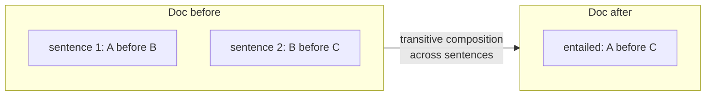
```mermaid
flowchart LR
    subgraph BEF["Doc before"]
        S1["sentence 1: A before B"]
        S2["sentence 2: B before C"]
    end
    BEF -->|"transitive composition<br/>across sentences"| AFT
    subgraph AFT["Doc after"]
        S3["entailed: A before C"]
    end
```

- **Input:** *Alice woke up. Then she had breakfast. Then she left for work.*
- **Output:** *Alice woke up before leaving for work.*

#### 14. Tense transformation

**Equivalence:** `past(P)  ⇔  has-been(perfective(P))`

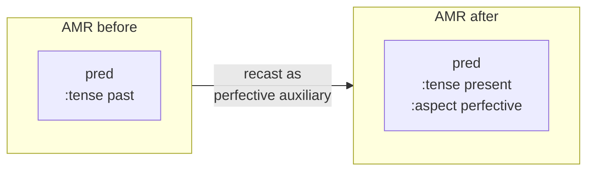
```mermaid
flowchart LR
    subgraph BEF["AMR before"]
        E1["pred<br/>:tense past"]
    end
    BEF -->|"recast as<br/>perfective auxiliary"| AFT
    subgraph AFT["AMR after"]
        E2["pred<br/>:tense present<br/>:aspect perfective"]
    end
```

- **Input:** *Alice finished the project.*
- **Output:** *Alice has finished the project.*

---

## License and citation

Original paper: Bao et al. ACL Findings 2024,
<https://aclanthology.org/2024.findings-acl.353/>. Extension code is
under the same license as the upstream repository.
